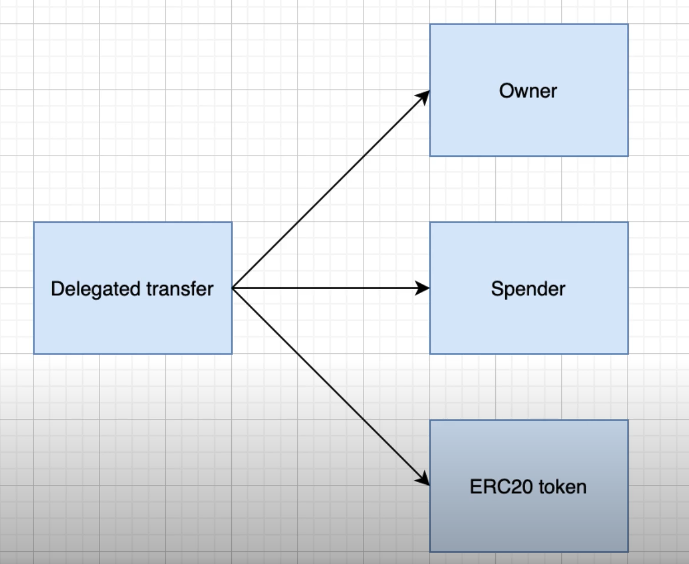
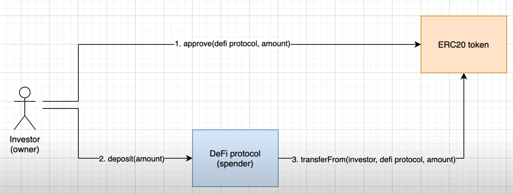

## ERC-20 Smart Contracts
Fungible assets
  - identical and can be exchanged for one another
  - eg $1 bill can be exchanged for any $1 bill

### Use cases 

- ERC20 tokens can be used as some form of **ownership** in the project
  - eg gives you right to the share of the profit/dividends 
  - similar to company stock
- They can also be used to represent **governance**
  - eg gives you the right to vote for the evolution of the protocol 
  - similar to voting shares in traditional finance
- IOU tokens
  - what you get when you invest other tokens into a protocol
  - can be redeemed against the token initially invested
  - This is the case with LP tokens
  - analogous to games where you can use real fiat to buy virtual money

### EIP-20 Token Standard
Here are some examples of functions as part of the standard interface for tokens:
```solidity
function name() public view returns (string)

function symbol() public view returns (string)

function decimals() public view returns (uint8)

function totalSupply() public view returns (uint256)

function balanceOf(address _owner) public view returns (uint256 balance)

function transfer(address _to, uint256 _value) public returns (bool success)
// Can transfer to another address (recipient and amount are arguments)
// _value needs to account for decimals()
// for the function to succeed
// - the caller must be the owner of the token
// - must have enough balance
// Transfer event is emitted if successful

function transferFrom(address _from, address _to, uint256 _value) public returns (bool success)
// Also transfers tokens, difference is delegated transfer (see section below)
// 3 addresses to consider: owner, spender, erc20 token

function approve(address _spender, uint256 _value) public returns (bool success)
// Everytime this function is called it will emit an Approval event
// to revoke the allowance of a spender simply call approval() with value 
// set to zero
``` 

### Delegated Transfer
This is where the Spender transfers some tokens on behalf of the Owner. The Owner needs to first call the approve() function to identify a Spender and specify the amount UP TO which they can spend.
  


- The investor wants to send his tokens to the DeFi protocol
- 1: Owner will approve the protocol to spend his coin on his behalf up to a limit
- 2: Owner will call the deposit() function of the DeFi protocol to initiate the transfer
- 3: The DeFi protocol will call the transferFrom()
- The coins will have transfered from the investor to the DeFi protocol
- this process may happen to ensure the IOU tokens get transferred properly to the investor 
---
### Other Notes

Julien's sample ERC20 code:

```solidity
pragma solidity ^0.7.3;

import '@openzeppelin/contracts/token/ERC20/ERC20.sol'

contract sampleToken is ERC20 {
  constructor() ERC20('Token Name', 'TOKEN_TICKER') {
    admin = msg.sender;
  }

  function mint(address to, uint amount) external {
    require(msg.sender == admin, 'only admin');
    _mint(to, amount);
  }
}

```

Then he created an Interface for ERC20 with:

```solidity

pragma solidity ^0.7.3;

import '@openzeppelin/contracts/token/ERC20/IERC20.sol'

interface ContractB {
  function deposit(uint amount) external;
  function withdraw(uint amount) external;
}

contract ContractA {
  IERC20 public token;
  ContractB public contractB; // pointer to the contract

  constructor(address _token, address _contractB) {
    token = IERC20(_token);
    contractB = ContractB(_contractB);
  }

  // Now with our token var we can interact with the token contract
  // An external address calls this function,
  // not a smart contract but an address controlled with a private key
  // before calling this function you need to call the approve() function of 
  //the token for the address of contractA,
  // and after our smart contract will call transferFrom()
  
  function deposit(uint amount) external {
    token.transferFrom(msg.sender, address(this), amount);
    token.approve(address(contractB), amount);
    contractB.deposit(amount);
  }

  function withdraw(uint amount) external {
    contractB.withdraw(amount);
    token.transfer(msg.sender, amount);
  }
}

```

When you see the contract code:
```solidity
contract LW3Token is ERC20 {
    ...
}
```
This refers to `LW3Token`:
- an instance of the ERC20 contract
- extending the ERC20 contract, inheriting the functions and logic built into ERC20, available for us to use and build our own custom logic on top.
- in OOP terms, this can be thought of as a class extending another class

[OpenZeppelin Implementation](https://github.com/OpenZeppelin/openzeppelin-contracts/blob/master/contracts/token/ERC20/ERC20.sol)

[EIP-20 Standard](https://eips.ethereum.org/EIPS/eip-20)

[[ERC20 Code Snippet |software.frameworks.solidity.erc20]]
