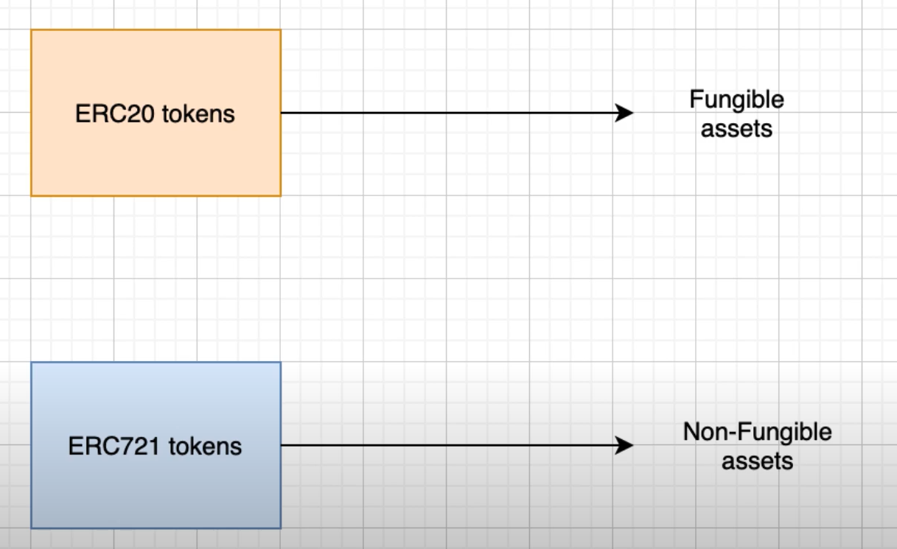

## ERC721 - Non-fungible assets

- Cannot be exchanged for another asset eg a piece of art or unique creation.
- Some potential use cases:
  - Insurance
  - Bonds
  - Derivatives

  

### How data is stored in the contracts
  - tokenIds are integers to identify each token
  - each tokenId is associated with the address of the owner
  - one-to-many relationship

---

### Julien's notes on Official specification
```solidity

function balanceOf(address _owner) external view returns (uint256);
//returns no of NFT owned by specific address - not the same as ERC20!

function ownerOf(uint256 _tokenId) external view returns (address);
// address of the owner of a specified NFT

//A
function safeTransferFrom(address _from, address _to, uint256 _tokenId, bytes data) external payable;
//B - without data param if not needed
function safeTransferFrom(address _from, address _to, uint256 _tokenId) external payable;
// Delegated and direct transfer
// checks if recipient is smart contract and implements function onERC721Received 

function transferFrom(address _from, address _to, uint256 _tokenId) external payable;
// does not do the check as the safeTransferFrom() signatures

function approve(address _approved, uint256 _tokenId) external payable;

function setApprovalForAll(address _operator, bool _approved) external;

function getApproved(uint256 _tokenId) external view returns (address);
// return specific address that is approved for this tokenId

function isApprovedForAll(address _owner, address _operator) external view returns (bool);


```
### Every ERC-721 compliant contract must implement the ERC721 and ERC165 interfaces (subject to “caveats”

```solidity

interface ERC721 /* is ERC165 */ {
  event Transfer(address indexed _from, address indexed _to, uint256 indexed _tokenId);
  event Approval(address indexed _owner, address indexed _approved, uint256 indexed _tokenId);
  event ApprovalForAll(address indexed _owner, address indexed _operator, bool _approved);


  ... functions outlined above ...
}

interface ERC165 {
    /// @notice Query if a contract implements an interface
    /// @param interfaceID The interface identifier, as specified in ERC-165
    /// @dev Interface identification is specified in ERC-165. This function
    ///  uses less than 30,000 gas.
    /// @return `true` if the contract implements `interfaceID` and
    ///  `interfaceID` is not 0xffffffff, `false` otherwise
    function supportsInterface(bytes4 interfaceID) external view returns (bool);
}

// Interface that must be used by smart contracts that receive ERC721 tokens

interface ERC721TokenReceiver {
    /// @notice Handle the receipt of an NFT
    /// @dev The ERC721 smart contract calls this function on the recipient
    ///  after a `transfer`. This function MAY throw to revert and reject the
    ///  transfer. Return of other than the magic value MUST result in the
    ///  transaction being reverted.
    ///  Note: the contract address is always the message sender.
    /// @param _operator The address which called `safeTransferFrom` function
    /// @param _from The address which previously owned the token
    /// @param _tokenId The NFT identifier which is being transferred
    /// @param _data Additional data with no specified format
    /// @return `bytes4(keccak256("onERC721Received(address,address,uint256,bytes)"))`
    ///  unless throwing
    function onERC721Received(address _operator, address _from, uint256 _tokenId, bytes _data) external returns(bytes4);
}
```  

### Optional Extensions 
```solidity
///Metadata 
/// @title ERC-721 Non-Fungible Token Standard, optional metadata extension
/// @dev See https://eips.ethereum.org/EIPS/eip-721
///  Note: the ERC-165 identifier for this interface is 0x5b5e139f.
interface ERC721Metadata /* is ERC721 */ {
    /// @notice A descriptive name for a collection of NFTs in this contract
    function name() external view returns (string _name);

    /// @notice An abbreviated name for NFTs in this contract
    function symbol() external view returns (string _symbol);

    /// @notice A distinct Uniform Resource Identifier (URI) for a given asset.
    // ** It points to a server outside the blockchain that is supposed to return JSON schema below
    /// @dev Throws if `_tokenId` is not a valid NFT. URIs are defined in RFC
    ///  3986. The URI may point to a JSON file that conforms to the "ERC721
    ///  Metadata JSON Schema".
    function tokenURI(uint256 _tokenId) external view returns (string);
}

/// @title ERC-721 Non-Fungible Token Standard, optional enumeration extension
/// @dev See https://eips.ethereum.org/EIPS/eip-721
///  Note: the ERC-165 identifier for this interface is 0x780e9d63.
interface ERC721Enumerable /* is ERC721 */ {
    /// @notice Count NFTs tracked by this contract
    /// @return A count of valid NFTs tracked by this contract, where each one of
    ///  them has an assigned and queryable owner not equal to the zero address
    function totalSupply() external view returns (uint256);

    /// @notice Enumerate valid NFTs
    /// @dev Throws if `_index` >= `totalSupply()`.
    /// @param _index A counter less than `totalSupply()`
    /// @return The token identifier for the `_index`th NFT,
    ///  (sort order not specified)
    function tokenByIndex(uint256 _index) external view returns (uint256);

    /// @notice Enumerate NFTs assigned to an owner
    /// @dev Throws if `_index` >= `balanceOf(_owner)` or if
    ///  `_owner` is the zero address, representing invalid NFTs.
    /// @param _owner An address where we are interested in NFTs owned by them
    /// @param _index A counter less than `balanceOf(_owner)`
    /// @return The token identifier for the `_index`th NFT assigned to `_owner`,
    ///   (sort order not specified)
    function tokenOfOwnerByIndex(address _owner, uint256 _index) external view returns (uint256);
}

```
### JSON metadata referenced above
```json
{
    "title": "Asset Metadata",
    "type": "object",
    "properties": {
        "name": {
            "type": "string",
            "description": "Identifies the asset to which this NFT represents"
        },
        "description": {
            "type": "string",
            "description": "Describes the asset to which this NFT represents"
        },
        "image": {
            "type": "string",
            "description": "A URI pointing to a resource with mime type image/* representing the asset to which this NFT represents. Consider making any images at a width between 320 and 1080 pixels and aspect ratio between 1.91:1 and 4:5 inclusive."
        }
    }
}
```

---


### Julien's demonstration
```solidity

pragma solidity ^0.7.3;

// Import the openzepplin contracts
import "@openzeppelin/contracts/token/ERC721/ERC721.sol";

// ERC721OpenZeppelin1 is  ERC721 signifies that the contract we are creating imports ERC721 and follows ERC721 contract from openzeppelin
contract ERC721OpenZeppelin1 is ERC721 {

    constructor() ERC721("Token Name", "Token Symbol") {
        // mint one NFT to yourself
        // safe means that it can check if the recipient is able to handle ERC721 tokens
        _safeMint(msg.sender, 0);

        // in this case the recipient is the address that deploys the contract
    }
}
```
### Next, for more flexibility and mint tokens with a dedicated function instead of the constructor...
```solidity
contract ERC721OpenZeppelin1 is ERC721 {

    constructor() ERC721("Token Name", "Token Symbol") {
        admin = msg.sender;
    }

    function mint(address to, uint tokenId) external {
      require(msg.sender == admin, 'only admin');
      _safeMint(to, tokenId);
    }
}

```

### Then, this is how we can create a faucet (anybody can mint any token) for ERC721...

```solidity

contract ERC721OpenZeppelin1 is ERC721 {

    constructor() ERC721("Token Name", "Token Symbol") {}

    function faucet(address to, uint tokenId) external {
      _safeMint(to, tokenId);
    }
}

```

### Next, how to do token transfers...


```solidity

pragma solidity ^0.7.3;

// We need this in order to receive ERC721
import "@openzeppelin/contracts/token/ERC721/ERC721Holder.sol";
// We need this in order to interact with ERC721 token
import "@openzeppelin/contracts/token/ERC721/IERC721.sol";

contract ContractA is ERC721Holder {
  IERC721 public token;

  constructor(address _token) {
    token = IERC721(_token);
  }

// Need to call the approve function before deposit function can be called
  function deposit(uint tokenId) external {
    token.safeTransferFrom(msg.sender, address(this), tokenId);
  }

  function withdraw(uint tokenId) external {
    // Direct transfer needs to be done this way as there is no dedicated transfer function
    token.safeTransferFrom(address(this),msg.sender, tokenId);
  }
}

```

### To make this more interesting, we can forward our ERC721 token to another contract...

```solidity


pragma solidity ^0.7.3;

import "@openzeppelin/contracts/token/ERC721/ERC721Holder.sol";
import "@openzeppelin/contracts/token/ERC721/IERC721.sol";

contract ContractB is ERC721Holder {
  function deposit(uint tokenId) external;
  function withdraw(uint tokenId) external;
}
contract ContractA is ERC721Holder {
  IERC721 public token;
  ContractB public contractB;

  constructor(address _token) {
    token = IERC721(_token);
    contractB = ContractB(_contractB);
  }

  function deposit(uint tokenId) external {
    token.safeTransferFrom(msg.sender, address(this), tokenId);
    token.approve(address(contractB), tokenId);
    contractB.deposit(tokenId);
  }

  function withdraw(uint tokenId) external {
    contractB.withdraw(tokenId);
    token.safeTransferFrom(address(this),msg.sender, tokenId);
  }
}
```

---

## Links

[Official specification](https://eips.ethereum.org/EIPS/eip-721) of ERC721 tokens
[Solidity implementation](https://github.com/OpenZeppelin/openzeppelin-contracts/blob/master/contracts/token/ERC721/ERC721.sol) of OpenZeppelin


[[Code snippet |software.frameworks.solidity.erc721]]

#ETB