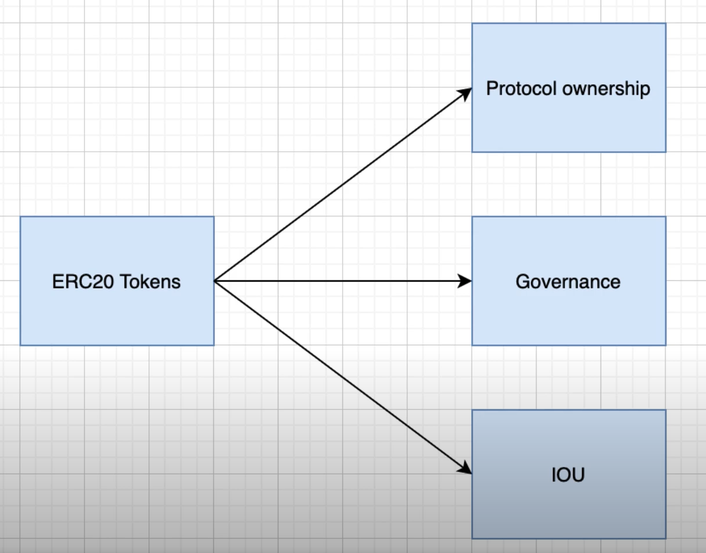

## Eat The Blocks - DEFI DEVELOPMENT MASTERY
---
### ERC-20 Smart Contracts
Fungible assets
  - identical and can be exchanged for one another
  - eg $1 bill can be exchanged for any $1 bill
  - other examples

- ERC20 tokens can be used as some form of **ownership** in the project
  - eg gives you right to the share of the profit/dividends 
  - similar to company stock
- They can also be used to represent **governance**
  - eg gives you the right to vote for the evolution of the protocol 
  - similar to voting shares in traditional finance
- IOU tokens
  - what you get when you invest other tokens into a protocol
  - can be redeemed against the token initially invested
  - This is the case with LP tokens
  - analogous to games where you can use real fiat to buy virtual money

[OpenZeppelin Implementation](https://github.com/OpenZeppelin/openzeppelin-contracts/blob/master/contracts/token/ERC20/ERC20.sol)

[[ERC20 Code Snippet |software.frameworks.solidity.erc20]]