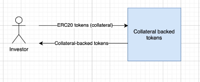

## Julien's notes
- Value is backed by ERC20 token
- send ERC tokens to smart contract, and in return receive collateral-backed tokens
- send back the CBT to burn and receive back the ERC tokens




### Julien's Demo
```solidity

pragma solidity ^0.7.3;

import '@openzeppelin/contracts/token/ERC20/ERC20.sol';
import '@openzeppelin/contracts/token/ERC20/IERC20.sol';

contract CollateralBackedToken is ERC20 {
  IERC20 public collateral; // pointer to the collateral smart contract
  uint public price = 1; // arbitrary price

  constructor(address _collateral) ERC20('Collateral Backed Token', 'CBT') {
    collateral = IERC(_collateral); // instantiate the contract to the collateral
  } // instantiate the constructor of ERC20 token with name and ticker

// argument: collateral amount you want to send
// need to call the approve function on the CBT first in order to spend it 
  function deposit(uint collateralAmount) external {
    // amount sent from the sender to the smart contract
    collateral.transferFrom(msg.sender, address(this), collateralAmount);
    _mint(msg.sender, collateralAmount * price)
  }

  function withdraw(uint tokenAmount) external {
    require(balanceOf(msg.sender) >= tokenAmount, 'balance too low');
    _burn(msg.sender, tokenAmount);
    collateral.transfer(tokenAmount / price);
  }
}

```
- Unlike wETH, price can be variable depending on nature of the CBT
- Overall, similar to wETH but small adaptations to use ERC20 instead of ether

---
## Links
[]() 
