- DEX = SC where investors can trade their tokens in a decentralised way
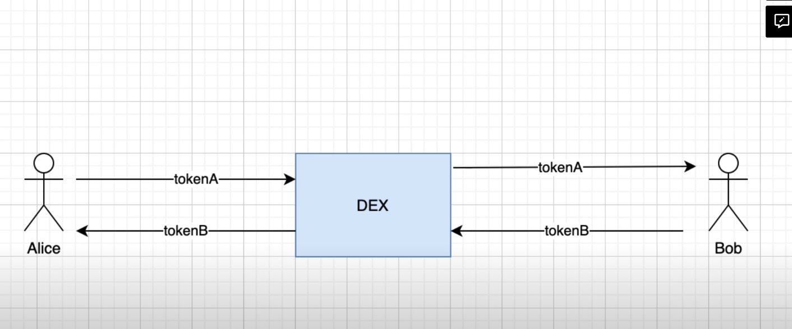

- No risk of having your tokens frozen
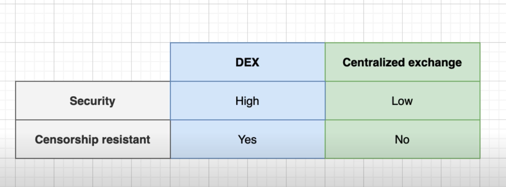
- old forms of DEXes used orderbooks where
  - people who bring liquidity are called "market makers"
  - Market makers use buy/sell limit orders to trade around
    - buy low; sell high, make profit
  - Problems of being a market maker:
    - needed lots of capital
    - needed to act quickly as markets changed
    - difficult to bring liquidity to these exchanges with an orderbook esp for small coins that hardly attract big market makers
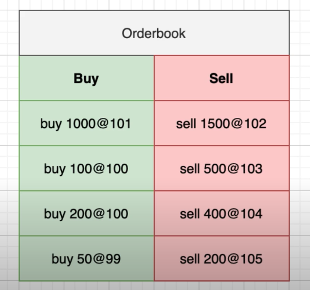

- Needed to find an alternative to orderbooks
- Vitalik released a paper that introduced the idea of an AMM
  - anybody could become an AMM
  - just have to send tokens to a SC and earn trading fees
  - how does it work?
    - Instead of "market makers" we usually refer to liquidity providers
    - AMM works with liquidity pools eg ETH/DAI

    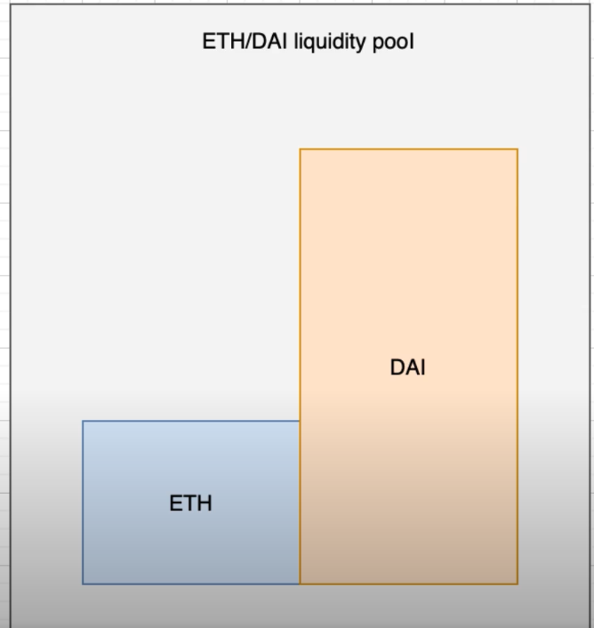
    - the ratio of the two assets determine the current price
    - LP sends the 2 assets to the SC of the Liq pool. 
    - Need to be the required proportion
    - Liq pool SC will send back LP tokens in exchange
    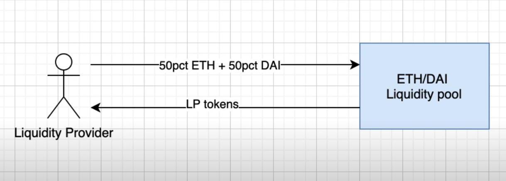
    - Then a trader uses the DEX swaps one asset of the pool against the other, eg trader sends DAI + trading fees to the pool and gets ETH in exchange
    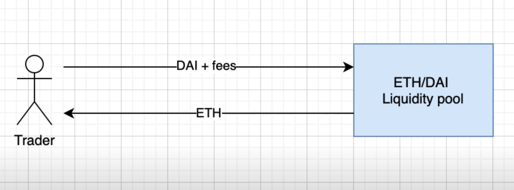
    - When the Liq provider wants to get back his/her money: 
      - needs to send back the LP token and get back the DAI/ETH + trading fees 
      - trading fees are a function of the time spent in the pool, amount invested as a weight of total liquidity
      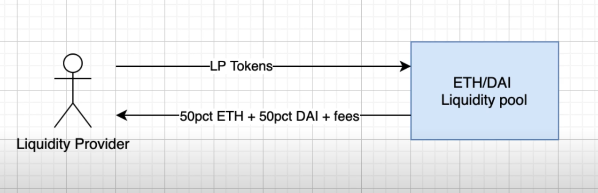
      - big question is how is the price determined?
        - SC uses the **constant product formula**
        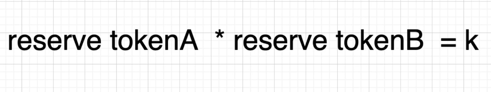
        - visually can be represented as this curve
        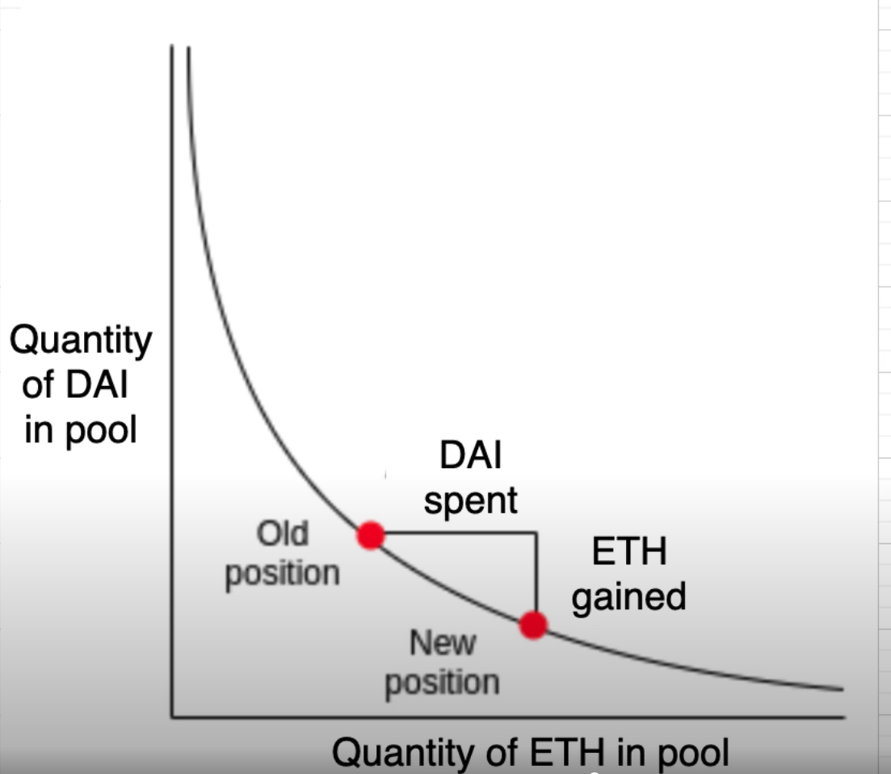
        - eg this is the equation that must be satisfied:
        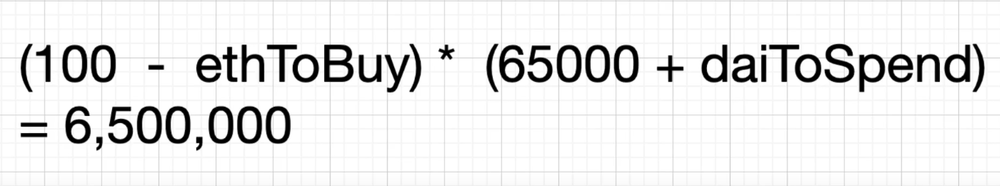
      - difference in prices?
        - can be due to slippage
        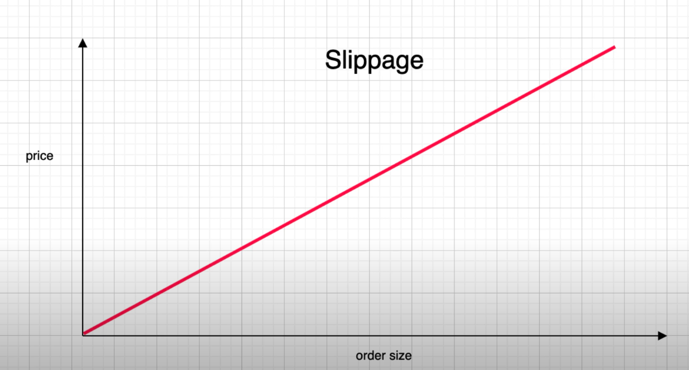
      - Impermanent Loss?
      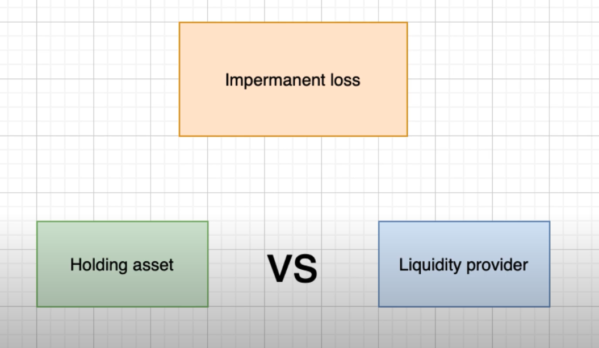
        - holding assets vs providing liq to an AMM can result in a loss due to a rapid change in price
        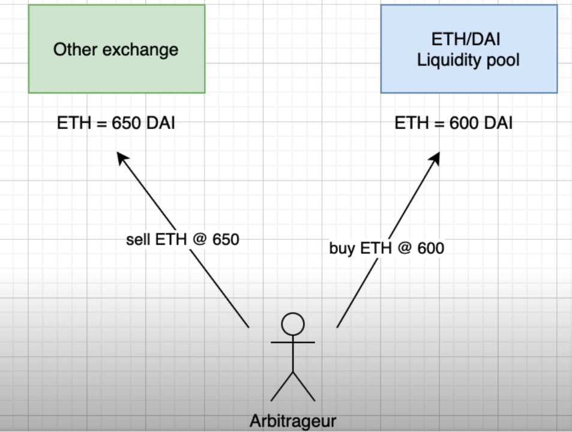

---

# Links

["On Path Independence" of Vitalik Buterin, foundational blog post for AMM](https://vitalik.ca/general/2017/06/22/marketmakers.html)
