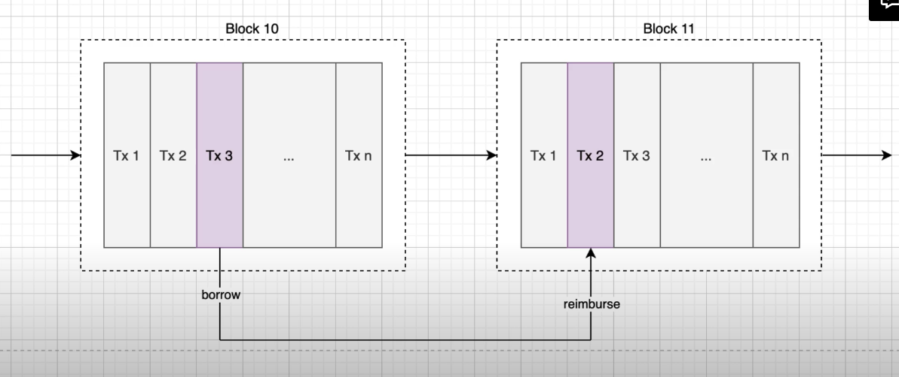
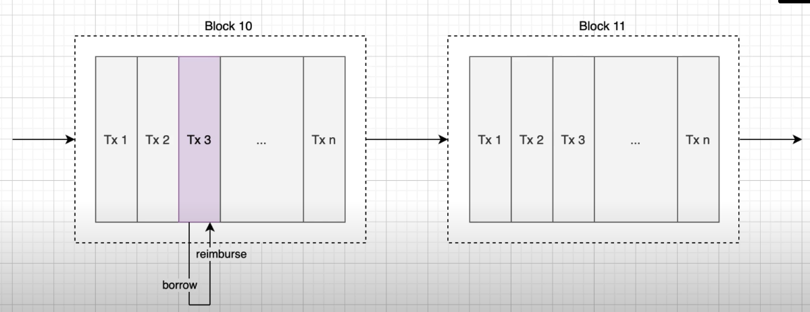

- Invented by the Aave protocol.
- Anyone able to borrow large amount of money on blockchain and use this money to profit on the blockchain.

## Main ways to profit
- Liquidations: Reimburse principal of a defaulting loan in exchange for the collateral and reward.
- Simple/Complex arbitrage

Ref: bZx flash loan exploit

## How does flashloan work?
- no need to provide collateral, no counterparty
- cannot run with the money! have to repay
- Normally...

- In the case of flashloans...

- ... there is no concept of a loan duration! Everything is instantaneous. 
- There is no need for collateral because if the loan is not reimbursed in the same transaction, the whole tx fails.

## The whole process
- There are 2 smart contracts:
  - Flashloan provider - provides the money! Usually an exchange like uniswap
  - Flashloan user - the borrower! Can request a large amount of money but limited by the liquidity of the provider


## Demo
FlashloanProvider.sol
```solidity
pragma solidity ^0.7.3;

import '@openzeppelin/contracts/token/ERC20/IERC20.sol';
import '@openzeppelin/contracts/utils/ReentrancyGuard.sol';
import './IFlashloanUser.sol'

contract FlashloanProvider is ReentrancyGuard {
  mapping(address => IERC20) public tokens;

  constructor(address[] memory _tokens) {
    for(uint i = 0; i < _tokens.length; i++) {
      tokens[_tokens[i]] = IERC20(_tokens[i]);
    }
  }

  function executeFlashloan(
    address callback, // where to send token
    uint amount,
    address _token, 
    bytes memory data // arbitrary data to be forwarded to borrower
  )
    nonReentrant()
    external
  {
    IERC20 token = tokens[_token];
    uint originalBalance = token.balanceOf(address(this));
    require(address(token) != address(0), 'token not supported');
    require(originalBalance >= amount, 'amount too high');
    token.transfer(callback, amount); // need to trigger the logic of the flashloan on the borrower side
    // standardise a specific function signature the borrower needs to implement

    IFlashloanUser(callback).flashloanCallback(amount, _token, data)
    require(
      token.balanceOf(address(this)) == originalBalance,
      'flashloan not reimbursed'
    )
  }
}

```

IFlashloanUser.sol
```solidity

pragma solidity ^0.7.3;

interface IFlashLoanUser {
  function flashloanCallback(uint amount, address token, bytes memory data) external;
}

```

FlashloanUser.sol
```solidity

pragma solidity ^0.7.3;

import '@openzeppelin/contracts/token/ERC20/IERC20.sol';
import './FlashloanProvider.sol';
import './IFlashloanUser.sol';

contract FlashloanUser is IFlashloanUser {
  function startFlashloan(
    address flashloan,
    uint amount,
    address token
  )
    external
  {
    FlashloanProvider(flashloan).executeFlashloan(
      address(this),
      amount,
      token,
      bytes('')
    );
  }

  function flashloanCallback(
    uint amount,
    address token,
    bytes memory data
  )
    override
    external
  {
    // do some arbitrage, liquidation, etc...

    // Reimburse borrowed tokens
    IERC20(token).transfer(msg.sender, amount);
  }
}

```