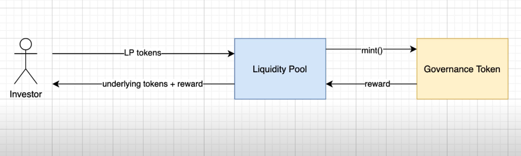

## Julien's notes
- One of the problems in DeFi is attracting liquidity
- owner of a DeFi protocol wants investors to send assets to SC
- on DEXes, investors are already rewarded with trading fees / interest
- But in order to make it more appealing to investors, some protocols launched extra incentives called **Liquidity Mining**
- With LM, when supplying liq to a protocol, get an extra reward paid in tokens.
- Longer providing liq = bigger reward
- More provided liq = bigger reward

### Example
- Investor provides liquidity, receives LP Tokens
- after some time, redeems LP tokens, and receive initial tokens back + reward


## Demo

Files: GovernanceToken.sol, LiquidityPool.sol, LpToken.sol, UnderlyingToken.sol

GovernanceToken.sol
```solidity

pragma solidity ^0.7.3;

import '@openzeppelin/contracts/token/ERC20/ERC20.sol';
import '@openzeppelin/contracts/access/Ownable.sol';

contract GovernanceToken is ERC20, Ownable {
  constructor() ERC20('Governance Token', 'GTK') Ownable() {
    
    function mint(address to, uint amount) external onlyOwner() {
      _mint(to, amount)
    }
  }
}

```

LpToken.sol
```solidity

pragma solidity ^0.7.3;

import '@openzeppelin/contracts/token/ERC20/ERC20.sol';

contract LpToken is ERC20 {
  constructor() ERC20('Lp Token', 'LTK')() {}
}

```

UnderlyingToken.sol
```solidity

pragma solidity ^0.7.3;

import '@openzeppelin/contracts/token/ERC20/ERC20.sol';

contract UnderlyingToken is ERC20 {
  constructor() ERC20('Lp Token', 'LTK')() {}

  function faucet(address to, uint amount) external {
    _mint(to, amount);
  }
}

```

LiquidityPool.sol
```solidity

pragma solidity ^0.7.3;

import './UnderlyingToken.sol'
import './LpToken.sol'
import './GovernanceToken.sol'

contract LiquidityPool is ERC20 {
  mapping(address => uint) public checkpoints;
  UnderlyingToken public underlyingToken;
  GovernanceToken public governanceToken;
  uint constant public REWARD_PER_BLOCK = 1;

  constructor(address _underlyingToken, address _governanceToken) {
    underlyingToken = UnderlyingToken(_underlyingToken);
    governanceToken = GovernanceToken(_governanceToken);
  }

  // checkpoints are used as reference to distribute the governance token reward
  function deposit(uint amount) external {
    if(checkpoints[msg.sender] == 0) {
      checkpoints[msg.sender] = block.number; 
    }
    _distributeRewards(msg.sender);
    underlyingToken.transferFrom(msg.sender, address(this), amount);
    _mint(msg.sender, amount);
  }

  function withdraw(uint amount) external {
    require(balanceOf(msg.sender) >= amount, 'not enough LP token');
    _distributeRewards(msg.sender);
    underlyingToken.transfer(msg.sender, amount);
    _burn(msg.sender, amount);
  }

  function _distributeRewards(address beneficiary) internal {
    uint checkpoint = checkpoints[beneficiary];
    if(block.number - checkpoint > 0) {
      uint distributionAmount = balanceOf(beneficiary) * (block.number - checkpoint) * REWARD_PER_BLOCK;
      governanceToken.mint(beneficiary, distributionAmount);
      checkpoints[beneficiary] = block.number;
    }
  }
}

```