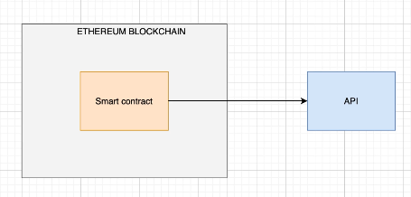
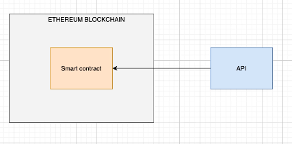
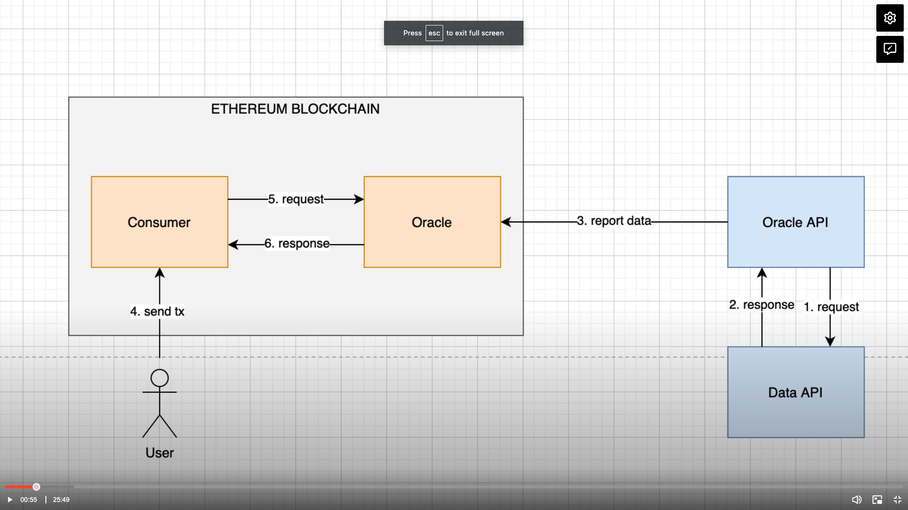
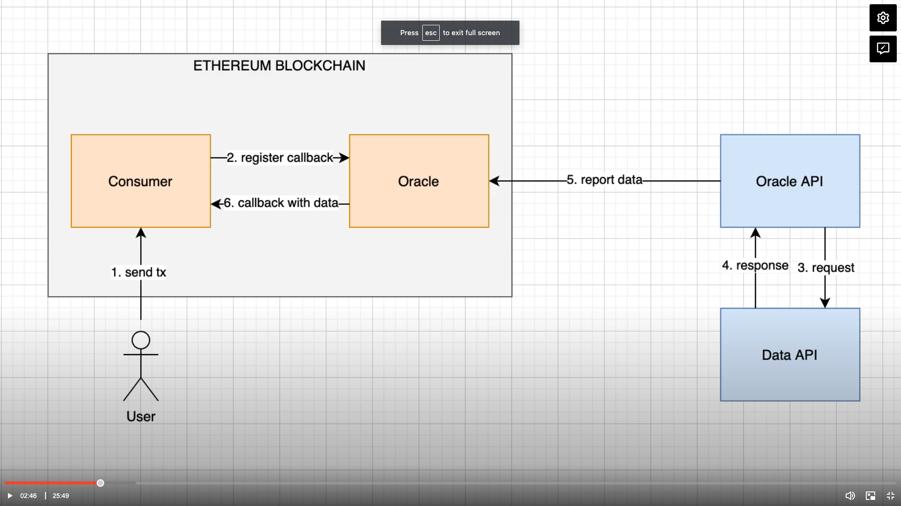

## Julien's notes

How can we fetch data for the data?

In the blockchain we can only interact with data already in the blockchain...so you cannot do this:


In reality we need an outside API to send a transaction to a smart contract in the blockchain and store outside data inside the SC...



The data flow in greater detail:


## Pull-based oracle
### First phase
- The Data API can be anything that has data that interests us
- Oracle API regularly makes requests from Data API to get updates
- it gets response, and the Oracle API will send a transaction to the Oracle smart contract with the fetched data
- So the Oracle system has 2 parts
  - off chain API
  - on chain smart contract

### Second phase
- Consumer smart contract will make use of the data that was reported to the blockchain
- A user will send a tx to the SC to do some action
- Since the Consumer SC requires the outside data, it will send a request to the Oracle SC, and the Oracle will respond with the needed data


## Push-based oracle

### First phase
- User (maybe an admin) tx sends to Consumer SC,
- Consumer SC registers callback to Oracle SC
  - "When you have updated data, callback my function in this contract"

### Second phase
- Oracle API sends request to the Data API
- Response is sent to Oracle
- Oracle calls back the Consumer SC with the data 
- In the callback function the Consumer SC will make use of the data

---

## Julien's Demo

Created files: 
- `Oracle.sol`, 
- `IOracle.sol`, 
- `Consumer.sol`


### First: Oracle.sol
```solidity

pragma solidity ^0.7.3;

contract Oracle {
  struct Data {
    uint date;
    uint payload;
  }
  address public admin;
  mapping(address => bool) public reporters;
  mapping(bytes32 => Data) public data;

  constructor(address _admin) {
    admin = _admin;
  }

  function updateReporter(address reporter, bool isReporter) external {
    require(msg.sender == admin, 'only admin');
    reporters[reporter] = isReporter;
  }

  function updateData(bytes32 key, uint payload) external {
    require(reporters[msg.sender] == true, 'only reporters');
    data[key] = Data(block.timestamp, payload);
  }

  function getData(bytes32 key)
    external
    view
    returns(bool result, uint date, uint payload) {
      if(data[key].date == 0) {
        return (false, 0, 0);
      }
      return (true, data[key].date, data[key].payload);
    }
}

```

### Second: Oracle Interface

```solidity

pragma solidity ^0.7.3;

interface IOracle {
  function getData(bytes32 key)
    external
    view
    returns(bool result, uint date, uint payload);
}

```

### Third: Consumer Smart Contract

```solidity

pragma solidity ^0.7.3;

import './IOracle.sol';

contract Consumer {
  IOracle public oracle;

  constructor(address _oracle) {
    oracle = IOracle(_oracle);
  }

  function foo() external {
    bytes32 key = keccak256(abi.encodePacked('BTC/USD'));
    // long string of 32 bytes

    (bool result, uint timestamp, uint data) = oracle.getData(key);
    require(result == true, 'could not get price');
    require(timestamp >= block.timestamp - 2 minutes, 'price too old');
    // do something with price
  }
}

```
- Ensure compilation works
- Next create a migration file to deploy SC eg `deploy.js`

```js

const Oracle = artifacts.require('Oracle.sol');
const Consumer = artifacts.require('Consumer.sol');

module.exports = async function(deployer, _network, addresses) {
  const [admin, reporter, _] = addresses;
  await deployer.deploy(Oracle, admin);
  const oracle = await Oracle.deployed();
  await oracle.updateReporter(reporter, true);
  await deployer.deploy(Consumer, oracle.address);
}
```

### Creating a price watcher (with CG)

price-watcher.js
```js

const CoinGecko = require('coingecko-api');
const Oracle = artifacts.require('Oracle.sol');

const POLL_INTERVAL = 5000;
const CoinGeckoClient = new CoinGecko();

module.exports = async done => {
  const [_, reporter] = await web3.eth.getAccounts();
  const oracle = await Oracle.deployed();

  while(true) {
    const response = await CoinGeckoClient.coins.fetch('bitcoin', {});
    let currentPrice = parseFloat(response.data.market_data.current_price.usd)
    currentPrice = parseInt(currentPrice * 100);
    await oracle.updateData(
      web3.utils.soliditySha3('BTC/USD), 
      currentPrice,
      {from: reporter}
    );
    console.log(`new price for BTC/USD ${currentPrice} updated on-chain`);
    await new Promise(resolve => setTimeout(resolve, POLL_INTERVAL));
  }
  done();
}

```

---
## Links
