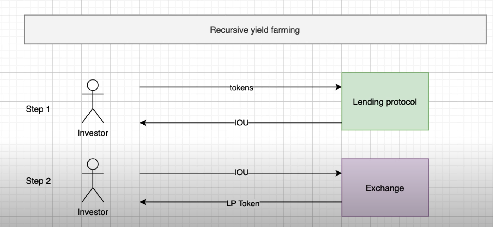
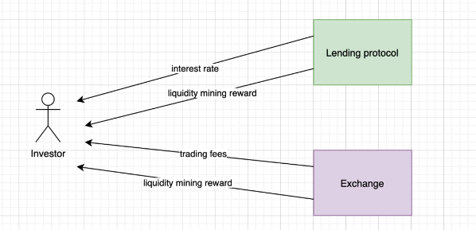

## Julien's Notes

No strict definition but:
- Yield Farming means to optimise DeFi investments to get a higher yield
- As a builder of DeFi protocols, it is good to know some techniques to optimise yields in DeFi
- offer more YF opportunities = attract more investors

Advanced Strategies 
- Crop rotation - reallocation of capital across different protocols at different blocks
  - Protocols that do this automatically for you are called **Yield Aggregators**
  - eg Yearn Finance
- Recursive Yield Farming - involves 2 protocols
  - eg Compound (lending protocol) and Curve(dex)
  - Providing LP tokens
  
  

Caveats:
- Trading Fees
- Defi risks
  - hacks
  - IL
  - liquidation risks
---

# Links
- [Pools FYI](https://pools.fyi/#/), a website to find the best liquidity pools accross all protocols
- **NOT WORKING** [Uniswap ROI](https://www.uniswaproi.com/), a website to find the best liquidity pools in Uniswap
- [Defi Rates](https://defirate.com/), a website to find the best yields in lending protocols