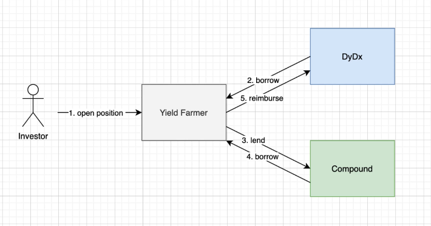
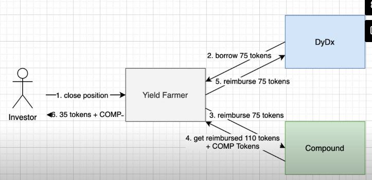

## Notes

- New markets can only be added through governance proposals
- interestModels: Each market's interest rate model has its own smart contract - generally the more in demand the token, the higher to IR
- PriceOracle: used to determine how much an address is allowed to borrow
- Comptroller: calculations
- Collateral factor: proportion that can be borrowed vs collateral
- Liquidator reimburse loans to obtain 105% collateral


## Demo 

Files: MyDeFiProject, ComptrollerInterface, CTokenInterface, PriceOracleInterface

MyDeFiProject.sol
```solidity

pragma solidity ^0.7.3

import '@openzeppelin/contracts/token/ERC20/IERC20.sol';
import './CTokenInterface.sol';
import './ComptrollerInterface.sol';
import './PriceOracleInterface.sol';

contract MyDeFiProject {
  ComptrollerInterface public comptroller;
  PriceOracleInterface public priceOracle;

  constructor(
    address _comptroller,
    address _priceOracle
  ) {
    comptroller = ComptrollerInterface(_comptroller);
    priceOracle = PriceOracleInterface(_priceOracle);
  }

// Lending part
  function supply(address cTokenAddress, uint underlyingAmount) external {
    CTokenInterface cToken = CTokenInterface(cTokenAddress);
    address underlyingAddress = cToken.underlying();
    IERC20(underlyingAddress).approve(cTokenAddress, underlyingAmount);
    uint result = cToken.mint(underlyingAmount);
    require(
      result == 0,
      'cToken#mint() failed. See Compound ErrorReporter.sol for more details'
    );
  }

  function redeem(address cTokenAddress, uint cTokenAmount) external {
    CTokenInterface cToken = CTokenInterface(cTokenAddress);
    uint result = cToken.redeem(cTokenAmount);
    require(
      result == 0,
      'cToken#redeem() failed. See Compound ErrorReporter.sol for more details'
    );
  }

  // Borrowing part

  function enterMarket(address cTokenAddress) external {
    address[] memory markets = new address[](1);
    markets[0] = cTokenAddress;
    uint[] memory results = comptroller.enterMarkets(markets);
    require(
      results[0] == 0,
      'cToken#enterMarket() failed. See Compound ErrorReporter.sol for more details' 
    );
  }

  function borrow(address cTokenAddress, uint borrowAmount) external {
    CTokenInterface cToken = CTokenInterface(cTokenAddress);
    address underlyingAddress = cToken.underlying();
    uint result = cToken.borrow(borrowAmount);
    require(
      result == 0,
      'cToken#borrow() failed. See Compound ErrorReporter.sol for more details' 
    );
  }

  function repayBorrow(address cTokenAddress, uint underlyingAmount) external {
    CTokenInterface cToken = CTokenInterface(cTokenAddress);
    address underlyingAddress = cToken.underlying();
    IERC20(underlyingAddress).approve(cTokenAddress, underlyingAmount); 
    uint result = cToken.repayBorrow(underlyingAmount);
    require(
      result == 0,
      'cToken#repayBorrow() failed. See Compound ErrorReporter.sol for more details' 
    );
  }

  function getMaxBorrow(address cTokenAddress) external view returns(uint) {
    (uint result, uint liquidity, uint shortfall) = comptroller
    .getAccountLiquidity(address(this));
    require(
      result == 0,
      'comptroller#getAccountLiquidity() failed. See Compound ErrorReporter.sol for more details' 
    );
    require(shortfall == 0, 'account underwater');
    require(liquidity > 0, 'account does not have collateral');
    uint underlyingPrice = priceOracle.getUnderlyingPrice(cTokenAddress);
    return liquidity / underlyingPrice;
  }
}

```

PriceOracleInterface.sol
```solidity

pragma solidity ^0.7.3

```

CTokenInterface.sol
```solidity

pragma solidity ^0.7.3

```

ComptrollerInterface.sol
```solidity

pragma solidity ^0.7.3

```

---

# Project 1: Compound Dashboard

- Simple vs Compound Interest
- Calculate the APY of Compound
  - `Compound APY = supply rate + COMP tokens rate`
  - supply rate: `(1+blockRate)^(blockNumberPerYear)`
  - COMP tokens rate: for every block within each market, amount distributed according to proportion of investor liquidity

## Backend: Calculate Supply APY (NextJS)

`npm install -g create-next-app`
`create-next-app .`

`npm install @compound-finance/compound-js`

file: apy.js

```js

import Compound from '@compound-finance/compound-js';

// Create Infura account to get the following
const provider = 'https://mainnet.infura.io/v3/983475...';

const comptroller = Compound.util.getAddress(Compound.Comptroller);
const opf = Compound.util.getAddress(Compound.PriceFeed);

const cTokenDecimals = 8;
const blocksPerDay = 4 * 60 * 24;
const daysPerYear = 365;
const ethMantissa = Math.pow(10, 18);

async function calculateSupplyApy(cToken) {
  const supplyRatePerBlock = await Compound.eth.read(
    cToken,
    'function supplyRatePerBlock() returns(uint)',
    [],
    { provider }
  );

  return Math.pow((supplyRatePerBlock / ethMantissa * blocksPerDay + 1, daysPerYear - 1) - 1);
}

```

## Backend: Calculate the COMP APY
  
Continuing from the code block above:

file: apy.js

```js

import Compound from '@compound-finance/compound-js';

const provider = 'https://mainnet.infura.io/v3/983475...';

const comptroller = Compound.util.getAddress(Compound.Comptroller);
const opf = Compound.util.getAddress(Compound.PriceFeed);

const cTokenDecimals = 8;
const blocksPerDay = 4 * 60 * 24;
const daysPerYear = 365;
const ethMantissa = Math.pow(10, 18);

async function calculateSupplyApy(cToken) {
  const supplyRatePerBlock = await Compound.eth.read(
    cToken,
    'function supplyRatePerBlock() returns(uint)',
    [],
    { provider }
  );

  return Math.pow((supplyRatePerBlock / ethMantissa * blocksPerDay + 1, daysPerYear - 1) - 1);
}

async function calculateCompApy(cToken, ticker, underlyingDecimals) {
  let compSpeed = await Compound.eth.read(
    comptroller,
    'function compSpeed(address cToken) public view returns(uint)',
    [cToken],
    {provider}
  );

  let compPrice = await Compound.eth.read(
    opf,
    'function price(string memory symbol) external view returns(uint)',
    [ Compound.COMP ],
    { provider }
  );

  let underlyingPrice = await Compound.eth.read(
    opf,
    'function price(string memory symbol) external view returns(uint)',
    [ ticker ],
    { provider }
  );

  let totalSupply = await Compound.eth.read(
    cToken,
    'function totalSupply() public view returns(uint)',
    [],
    { provider }
  );

  let exchangeRate = await Compound.eth.read(
    cToken,
    'function exchangeRateCurrent() public returns(uint)',
    [],
    { provider }
  );

  compSpeed = compSpeed / 1e18;
  compPrice = compPrice / 1e6;
  underlyingPrice = underlyingPrice / 1e6;
  exchangeRate = +exchangeRate.toString() / ethMantissa;
  totalSupply = totalSupply().toString() * exchangeRate * underlyingPrice / Math.pow(10, underlyingDecimals);
  const compPerDay = compSpeed * blocksPerDay;

  return 100 * (compPrice * compPerDay / totalSupply) * 365
}

```


## Backend: Calculate the Total APY

Continuing from the code block above:

file: apy.js

```js

import Compound from '@compound-finance/compound-js';

const provider = 'https://mainnet.infura.io/v3/983475...';

const comptroller = Compound.util.getAddress(Compound.Comptroller);
const opf = Compound.util.getAddress(Compound.PriceFeed);

const cTokenDecimals = 8;
const blocksPerDay = 4 * 60 * 24;
const daysPerYear = 365;
const ethMantissa = Math.pow(10, 18);

async function calculateSupplyApy(cToken) {
  const supplyRatePerBlock = await Compound.eth.read(
    cToken,
    'function supplyRatePerBlock() returns(uint)',
    [],
    { provider }
  );

  return Math.pow((supplyRatePerBlock / ethMantissa * blocksPerDay + 1, daysPerYear - 1) - 1);
}

async function calculateCompApy(cToken, ticker, underlyingDecimals) {
  let compSpeed = await Compound.eth.read(
    comptroller,
    'function compSpeed(address cToken) public view returns(uint)',
    [cToken],
    {provider}
  );

  let compPrice = await Compound.eth.read(
    opf,
    'function price(string memory symbol) external view returns(uint)',
    [ Compound.COMP ],
    { provider }
  );

  let underlyingPrice = await Compound.eth.read(
    opf,
    'function price(string memory symbol) external view returns(uint)',
    [ ticker ],
    { provider }
  );

  let totalSupply = await Compound.eth.read(
    cToken,
    'function totalSupply() public view returns(uint)',
    [],
    { provider }
  );

  let exchangeRate = await Compound.eth.read(
    cToken,
    'function exchangeRateCurrent() public returns(uint)',
    [],
    { provider }
  );

  compSpeed = compSpeed / 1e18;
  compPrice = compPrice / 1e6;
  underlyingPrice = underlyingPrice / 1e6;
  exchangeRate = +exchangeRate.toString() / ethMantissa;
  totalSupply = totalSupply().toString() * exchangeRate * underlyingPrice / Math.pow(10, underlyingDecimals);
  const compPerDay = compSpeed * blocksPerDay;

  return 100 * (compPrice * compPerDay / totalSupply) * 365
}

async function calculateApy(cTokenTicker, underlyingTicker) {
  const underlyingDecimals = Compound.decimals[cTokenTicker];
  const cTokenAddress = Compound.util.getAddress(cTokenTicker);
  const [supplyApy, compApy] = await Promise.all([
    calculateSupplyApy(cTokenAddress),
    calculateCompApy(cTokenAddress, underlyingTicker, underlyingDecimals)
  ]);
  return {ticker: underlyingTicker, supplyApy, compApy};
}

export default calculateApy;
```

## Frontend

`npm install bootstrap`

`vim pages/_apy.js`
```js

import '../styles/globals.css'
import 'bootstrap/dist/css/bootstrap.min.css';

function MyApp({ Component, pageProps }) {
  return <Component {...pageProps} />
}
export default MyApp;

```

`index.js`
```js

import styles from '../styles/Home.module.css'
import Compound from '@compound-finance/compound-js';
import calculateApy from '../apy.js';

export default function Home({ apys }) {
  const formatPercent = number => `${new Number(number).toFixed(2)}%`

  return(
    <div className='container'>
      <Head>
        <title>Compound dashboard</title>
        <link rel="icon" href="/favicon.ico"/>
      </Head>
      
      <div className='row mt-4'>
        <div className='col-sm-12'>
          <div className='jumbotron'>
            <h1 className='text-center'>Compound Dashboard</h1>
            <h5 className='display-4 text-center'>Shows Compound APYs <br/> with COMP token rewards</h5>
          </div>
        </div>
      </div>
      <table className='table'>
        <thead>
          <tr>
            <th>Ticker</th>
            <th> Supply APY</th>
            <th>COMP APY</th>
            <th>Total APY</th>
          </tr>
        </thead>
        <tbody>
          {apys && apys.map(apy => (
            <tr key={apy.ticker}>
              <td>
              
              // Create img folder in public
                {formatPercent(apy.ticker.toUpperCase())}
              </td>
              <td>
                {formatPercent(apy.supplyApy)}
              </td>
              <td>
                {formatPercent(apy.compApy)}
              </td>
              <td>
                {formatPercent(parseFloat(apy.supplyApy) + parseFloat(apy.compApy))}
              </td>
          ))}
        </tbody>
      </table>
    </div>
  )
}

export async function getServerSideProps(context) {
  const apys = await Promise.all([
    calculateApy(Compound.cDAI, 'DAI'),
    calculateApy(Compound.cUSDC, 'USDC'),
    calculateApy(Compound.cUSDT, 'USDT'),
  ]);

  return{
    props: {
      apys
    }
  }
}


```

# Project 2: Yield Farming on Compound

## Smart contract architecture
- Flashloan from dydx is FREE
- 3 different SCs
  - Yield farmer
  - DyDx
  - Compound




## Smart contract flashloan integration

`npm install @openzeppelin/contracts@2.5.1`
`npm install @studydefi/money-legos` - used to integrate with DyDx

files: Yieldfarmer.sol

Yieldfarmer.sol
```solidity

pragma solidity ^0.5.7;
pragma experimental ABIEncoderV2;

import '@studydefi/money-legos/dydx/contracts/DydxFlashloanBase.sol';
import '@studydefi/money-legos/dydx/contracts/ICallee.sol';
import '@openzeppelin/contracts/token/ERC20/IERC20.sol';

contract YieldFarmer is ICallee, DydxFlashloanBase {
  enum Direction { Deposit, Withdraw }
  struct Operation {
    address token;
    address cToken;
    Direction direction;
    uint amountProvided;
    uint amountBorrowed;
  }
  address public owner;

  constructor() public {
    owner = msg.sender;
  }
}

// once money borrowed for flashloan....
function callFunction(
  address sender,
  Account.Info memory account,
  bytes memory data
) public {
  Operation memory operation = abi.decode(data, (Operation));
}

function _initiateFlashloan(
    address _solo, 
    address _token, 
    address _cToken, 
    Direction _direction,
    uint _amountProvided, 
    uint _amountBorrowed
  )
    internal
  {
    // pointer to the SC of DyDx
    ISoloMargin solo = ISoloMargin(_solo);

    // Get marketId from token address
    uint256 marketId = _getMarketIdFromTokenAddress(_solo, _token);

    // Calculate repay amount (_amount + (2 wei))
    // Approve transfer from
    uint256 repayAmount = _getRepaymentAmountInternal(_amountBorrowed);
    IERC20(_token).approve(_solo, repayAmount);

    // 1. Withdraw $
    // 2. Call callFunction(...)
    // 3. Deposit back $
    Actions.ActionArgs[] memory operations = new Actions.ActionArgs[](3);

    operations[0] = _getWithdrawAction(marketId, _amountBorrowed);
    operations[1] = _getCallAction(
        // Encode MyCustomData for callFunction
        abi.encode(Operation({
          token: _token, 
          cToken: _cToken, 
          direction: _direction,
          amountProvided: _amountProvided, 
          amountBorrowed: _amountBorrowed
        }))
    );
    operations[2] = _getDepositAction(marketId, repayAmount);

    Account.Info[] memory accountInfos = new Account.Info[](1);
    accountInfos[0] = _getAccountInfo();

    solo.operate(accountInfos, operations);
  }
```


## Smart contract Compound integration

files: CTokenInterface.sol, ComptrollerInterface.sol, Compound.sol

CTokenInterface.sol
```solidity

pragma solidity ^0.5.7;

interface CTokenInterface {
  function mint(uint mintAmount) external returns (uint);
  function redeem(uint redeemTokens) external returns (uint);
  function borrow(uint borrowAmount) external returns (uint);
  function repayBorrow(uint repayAmount) external returns (uint);
  function borrowBalanceCurrent(address account) external returns (uint);
  function balanceOf(address owner) external view returns (uint);
  function underlying() external view returns(address);
}

```

ComptrollerInterface.sol
```solidity

pragma solidity ^0.5.7;

interface ComptrollerInterface {
  function enterMarkets(address[] calldata cTokens) external returns (uint[] memory);
  function claimComp(address holder) external;
  function getCompAddress() external view returns(address);
}

```

Compound.sol
```solidity

pragma solidity ^0.5.7;

import '@openzeppelin/contracts/token/ERC20/IERC20.sol';
import './CTokenInterface.sol';
import './ComptrollerInterface.sol';

contract Compound {
  ComptrollerInterface public comptroller;

  constructor(
    address _comptroller
  ) public {
    comptroller = ComptrollerInterface(_comptroller);
  }

  function supply(address cTokenAddress, uint underlyingAmount) internal {
    CTokenInterface cToken = CTokenInterface(cTokenAddress);
    address underlyingAddress = cToken.underlying(); 
    IERC20(underlyingAddress).approve(cTokenAddress, underlyingAmount);
    uint result = cToken.mint(underlyingAmount);
    require(
      result == 0, 
      'cToken#mint() failed. see Compound ErrorReporter.sol for details'
    );
  }

  function redeem(address cTokenAddress, uint cTokenAmount) internal {
    CTokenInterface cToken = CTokenInterface(cTokenAddress);
    uint result = cToken.redeem(cTokenAmount);
    require(
      result == 0,
      'cToken#redeem() failed. see Compound ErrorReporter.sol for more details'
    );
  }

// indicate to Compound which token we use as collateral
  function enterMarket(address cTokenAddress) internal {
    address[] memory markets = new address[](1);
    markets[0] = cTokenAddress; 
    uint[] memory results = comptroller.enterMarkets(markets);
    require(
      results[0] == 0, 
      'comptroller#enterMarket() failed. see Compound ErrorReporter.sol for details'
    ); 
  }

  function borrow(address cTokenAddress, uint borrowAmount) internal {
    CTokenInterface cToken = CTokenInterface(cTokenAddress);
    uint result = cToken.borrow(borrowAmount);
    require(
      result == 0, 
      'cToken#borrow() failed. see Compound ErrorReporter.sol for details'
    ); 
  }

  function repayBorrow(address cTokenAddress, uint underlyingAmount) internal {
    CTokenInterface cToken = CTokenInterface(cTokenAddress);
    address underlyingAddress = cToken.underlying(); 
    IERC20(underlyingAddress).approve(cTokenAddress, underlyingAmount);
    uint result = cToken.repayBorrow(underlyingAmount);
    require(
      result == 0, 
      'cToken#borrow() failed. see Compound ErrorReporter.sol for details'
    ); 
  }

  function claimComp() internal {
    comptroller.claimComp(address(this));
  }

  function getCompAddress() internal view returns(address) {
    return comptroller.getCompAddress();
  }

  function getcTokenBalance(address cTokenAddress) public view returns(uint){
    return CTokenInterface(cTokenAddress).balanceOf(address(this));
  }

  //No view keyword because borrowBalanceCurrent() can be called in a tx, and Solidity complains if view
  function getBorrowBalance(address cTokenAddress) public returns(uint){
    return CTokenInterface(cTokenAddress).borrowBalanceCurrent(address(this));
  }
}

```


## Yield farming - Open position

Yieldfarmer.sol
```solidity

pragma solidity ^0.5.7;
pragma experimental ABIEncoderV2;

import '@studydefi/money-legos/dydx/contracts/DydxFlashloanBase.sol';
import '@studydefi/money-legos/dydx/contracts/ICallee.sol';
import '@openzeppelin/contracts/token/ERC20/IERC20.sol';
import './Compound.sol';

contract YieldFarmer is ICallee, DydxFlashloanBase {
  enum Direction { Deposit, Withdraw }
  struct Operation {
    address token;
    address cToken;
    Direction direction;
    uint amountProvided;
    uint amountBorrowed;
  }
  address public owner;

  constructor() public {
    owner = msg.sender;
  }

  function openPosition(
    address _solo,
    address _token,
    address _cToken,
    address _amountProvided,
    address _amountBorrowed,
  ) external {
    require(msg.sender == only, 'only owner');
    _initiateFlashloan(_solo, _token, _cToken, Direction.Deposit, _amountProvided - 2, _amountBorrowed);
  }

  // once money borrowed for flashloan....
  function callFunction(
    address sender,
    Account.Info memory account,
    bytes memory data
  ) public {
    Operation memory operation = abi.decode(data, (Operation));
  }

  if(operation.direction == Direction.Deposit) {
    supply(operation.cToken, operation.amountProvided + operationBorrowed);
    enterMarket(operation.cToken);
    borrow(operation.cToken, operation.amountBorrowed);
  }

  function _initiateFlashloan(
      address _solo, 
      address _token, 
      address _cToken, 
      Direction _direction,
      uint _amountProvided, 
      uint _amountBorrowed
    )
    internal
  {
    // pointer to the SC of DyDx
    ISoloMargin solo = ISoloMargin(_solo);

    // Get marketId from token address
    uint256 marketId = _getMarketIdFromTokenAddress(_solo, _token);

    // Calculate repay amount (_amount + (2 wei))
    // Approve transfer from
    uint256 repayAmount = _getRepaymentAmountInternal(_amountBorrowed);
    IERC20(_token).approve(_solo, repayAmount);

    // 1. Withdraw $
    // 2. Call callFunction(...)
    // 3. Deposit back $
    Actions.ActionArgs[] memory operations = new Actions.ActionArgs[](3);

    operations[0] = _getWithdrawAction(marketId, _amountBorrowed);
    operations[1] = _getCallAction(
        // Encode MyCustomData for callFunction
        abi.encode(Operation({
          token: _token, 
          cToken: _cToken, 
          direction: _direction,
          amountProvided: _amountProvided, 
          amountBorrowed: _amountBorrowed
        }))
    );
    operations[2] = _getDepositAction(marketId, repayAmount);

    Account.Info[] memory accountInfos = new Account.Info[](1);
    accountInfos[0] = _getAccountInfo();

    solo.operate(accountInfos, operations);
  }
}
```


## Yield farming - Close position

- exit borrowing and lending position in Compound

Yieldfarmer.sol
```solidity

pragma solidity ^0.5.7;
pragma experimental ABIEncoderV2;

import '@studydefi/money-legos/dydx/contracts/DydxFlashloanBase.sol';
import '@studydefi/money-legos/dydx/contracts/ICallee.sol';
import '@openzeppelin/contracts/token/ERC20/IERC20.sol';
import './Compound.sol';

contract YieldFarmer is ICallee, DydxFlashloanBase {
  enum Direction { Deposit, Withdraw }
  struct Operation {
    address token;
    address cToken;
    Direction direction;
    uint amountProvided;
    uint amountBorrowed;
  }
  address public owner;

  constructor() public {
    owner = msg.sender;
  }

  function openPosition(
    address _solo,
    address _token,
    address _cToken,
    address _amountProvided,
    address _amountBorrowed,
  ) external {
    require(msg.sender == only, 'only owner');
    _initiateFlashloan(_solo, _token, _cToken, Direction.Deposit, _amountProvided - 2, _amountBorrowed);
  }

  function closePosition(
    address _solo,
    address _token,
    address _cToken, 
  ) external {
    require(msg.sender == only, 'only owner');
    IERC20(_token).transferFrom(msg.sender, address(this), 2);
    claimComp();
    uint borrowBalance = getBorrowBalance(_cToken);
    _initiateFlashloan(_solo, _token, _ctoken, Direction.Withdraw, 0, borrowBalance); //what we borrowed + interest

    // COMP
    address compAddress = getCompAddress();
    IERC20 comp = IERC20(compAddress);
    uint compBalance = comp.balanceOf(address(this));
    comp.transfer(msg.sender, compBalance);

    //token
    IERC20 token = IERC20(_token);
    uint tokenBalance = token.balanceOf(address(this));
    token.transfer(msg.sender, tokenBalance);
  }

  // once money borrowed for flashloan....
  function callFunction(
    address sender,
    Account.Info memory account,
    bytes memory data
  ) public {
    Operation memory operation = abi.decode(data, (Operation));
  }

  if(operation.direction == Direction.Deposit) {
    supply(operation.cToken, operation.amountProvided + operationBorrowed);
    enterMarket(operation.cToken);
    borrow(operation.cToken, operation.amountBorrowed);
  } else {
    repayBorrow(operation.cToken, operation.amountBorrowed);
    uint cTokenBalance = getcTokenBalance(operation.cToken);
    redeem(operation.cToken, cTokenBalance);
  }

  function _initiateFlashloan(
      address _solo, 
      address _token, 
      address _cToken, 
      Direction _direction,
      uint _amountProvided, 
      uint _amountBorrowed
    )
    internal
  {
    // pointer to the SC of DyDx
    ISoloMargin solo = ISoloMargin(_solo);

    // Get marketId from token address
    uint256 marketId = _getMarketIdFromTokenAddress(_solo, _token);

    // Calculate repay amount (_amount + (2 wei))
    // Approve transfer from
    uint256 repayAmount = _getRepaymentAmountInternal(_amountBorrowed);
    IERC20(_token).approve(_solo, repayAmount);

    // 1. Withdraw $
    // 2. Call callFunction(...)
    // 3. Deposit back $
    Actions.ActionArgs[] memory operations = new Actions.ActionArgs[](3);

    operations[0] = _getWithdrawAction(marketId, _amountBorrowed);
    operations[1] = _getCallAction(
        // Encode MyCustomData for callFunction
        abi.encode(Operation({
          token: _token, 
          cToken: _cToken, 
          direction: _direction,
          amountProvided: _amountProvided, 
          amountBorrowed: _amountBorrowed
        }))
    );
    operations[2] = _getDepositAction(marketId, repayAmount);

    Account.Info[] memory accountInfos = new Account.Info[](1);
    accountInfos[0] = _getAccountInfo();

    solo.operate(accountInfos, operations);
  }
}
```

## Smart contract deployment
- at root of project create migration called `2_deploy_contracts.js`
- 


---
# Links
[Official documentation](https://compound.finance/docs) of Compound
[Github repo](https://github.com/compound-finance) of Compound
[Contract addresses](https://github.com/compound-finance/compound-config/tree/master/networks) of Compound
[Interest rate](https://observablehq.com/@jflatow/compound-interest-rates) models

Money Legos (library used for flashloan)
[DyDx docs](https://docs.dydx.exchange/#general)

[ETB Github repo](https://github.com/jklepatch/eattheblocks/blob/master/defi-development-mastery/4-project-yield-farming/contracts/YieldFarmer.sol)