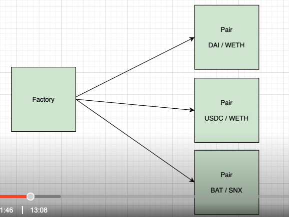

## What is it?
- It is a decentralised exchange to trade ERC20 tokens using smart contracts on Ethereum
- It uses a liquidity pool, no trading between specific traders

The SCs:
- Factory: create the different markets (Pairs), acts as a registry for all the markets
- Pair: Each market represented by this SC
  - an actor is called Liquidity Provider, it can be anybody who provides tokens and acts as a market maker for a specific market. In exchange they receive an LP token which can be redeemed against the original tokens + trading fee.
  - another actor is a trader, who pays trading fees when doing a swap
- Router: Utility that helps users use uniswap simply
  - this makes it convenient for traders and Liq providers to interact with the pair contract
  - complex trading between 2 pairs to create synthetic market. eg DAI/wETH and USDC/wETH
  - can swap between ether and wrapped ether
- ERC20




## Demo

MyDefiProject.sol
```solidity

pragma solidity ^0.7.0;

interface IUniswap {
  function swapExactTokensForETH(
    uint amountIn, 
    uint amountOutMin, 
    address[] calldata path, 
    address to, 
    uint deadline)
    external
    returns (uint[] memory amounts)
    function WETH() external pure returns (address);
}

interface IERC20 {
  function transferFrom(
      address from,
      address to,
      uint256 amount
  ) external returns (bool);
  function approve(address spender, uint256 amount) external returns (bool);
}

contract MyDefiProject {
  IUniswap uniswap;

  constructor(address _uniswap) {
    uniswap = IUniswap(_uniswap);
  }

  function swapTokensForETH(
    address token, 
    uint amountIn, 
    uint amountOutMin, 
    uint deadline)
    external {
      IERC20(token).transferFrom(msg.sender, address(this), amountIn);
      address[] memory path = new address[](2);
      path[0] = token;
      path[1] = uniswap.WETH();
      IERC20(token).approve(address(uniswap), amountIn);
      uniswap.swapExactTokensForETH(
        amountIn,
        amountOutMin,
        path,
        msg.sender,
      )
    }
  
}
```

---
# Links
[Documentation](https://docs.uniswap.org/protocol/introduction) of Uniswap
[v3-core Github repo](https://github.com/Uniswap/v3-core) for core contract (for Factory & Pair contracts)
[Github repo](https://github.com/Uniswap/v3-periphery) for Router contract