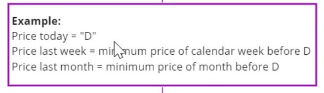

## Historical Pricing in BB Estimator

- Prices changing on a weekly basis
- How do we want to display this?
- How are we going to construct the source of data?
  - Currently estimator db needs refresh periodically
  - long term: save previous day's data point before deploying out to production

- Display material attributes and price history
  - Source of data
  - Search bar, filters
  - Attributes ( size, diameter etc)
  - Retail price, BCS unit price
    - unsure if revealing supplier names, which price, which supplier
    - currently in live estimator we do not reveal which supplier for retail
    - In marketplace, row will be missing/gone
    - Editable functionality, Screenshots used by sub-cons
    - date picker tools - perhaps set constraints like 6 months of history
    - feature: hover over price reveals supplier name
    - feature: show unit price history pop-up?
      - do we want to do this?
      - distributor or trader means can compete on Pricing
      - internal/external it is ok to show range
      - scraping? priority is : PO for BCS
    - data (TBD): reveal supplier name at top of page
      - blurring of name
    - design Q: prices that prevail from various source companies
    
    
    ## Part 2: Pricing label + Login flow
      - proposing to create 2 different UI templates for different audiences.
      - eg sign in with YTL email, then access granted to restricted content; otherwise UI template #2
      - Fai to assess effort involved
      - Feature: Forgot password - need admin@bluebridge email
        - or use support-bluebridge@ytl email
      - TJ Question: Login page -> save time by having a universal password

## Questions 
- are you pulling from live sheets or downloaded CSV
- determining old price - date or "last refresh"?
  - See 
- Date filter - must-have or nice-to-have?
  - good to have, otherwise they will have to do it manually
  - can reconsider if it is a blocker
  - potentially it is a week delay
  - priority: filter for those materials with many SKUs
  - If full set of data is there can lead with that first
