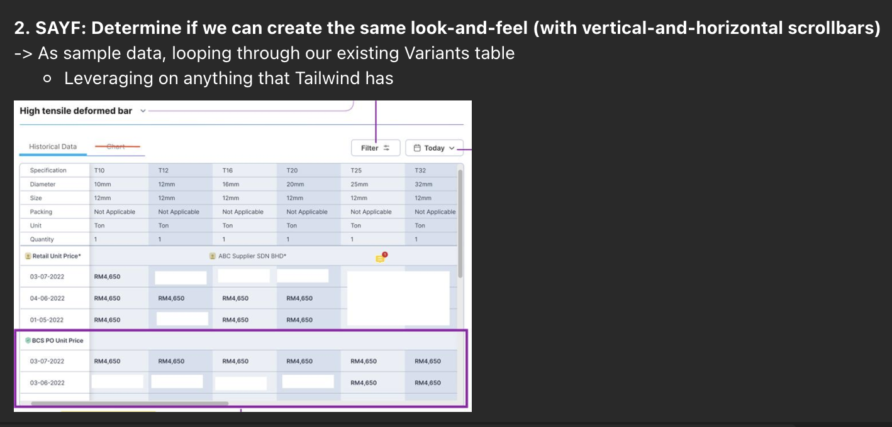

## Daily Standup

- POC3
- Button loader for sm/mobile screens
- Summary of acumatica training

### Spike Findings
Read up more at: [Wikipedia](https://en.wikipedia.org/wiki/Spike_(software_development)) and 
- L1, L2 L3 chaining
- When loading the data, which part of the chain
- same sub-category, different flow, will require specific logins
- vs common flow for each sub-category
- we decided to move the attribute sequencing to be post POC3

### Daily tasks

- Useful links:
[Stack](https://stackoverflow.com/questions/3402295/html-table-with-horizontal-scrolling-first-column-fixed)
[w3](https://www.w3.org/WAI/tutorials/tables/one-header/)
- Question: small/mobile screen works for button loader?