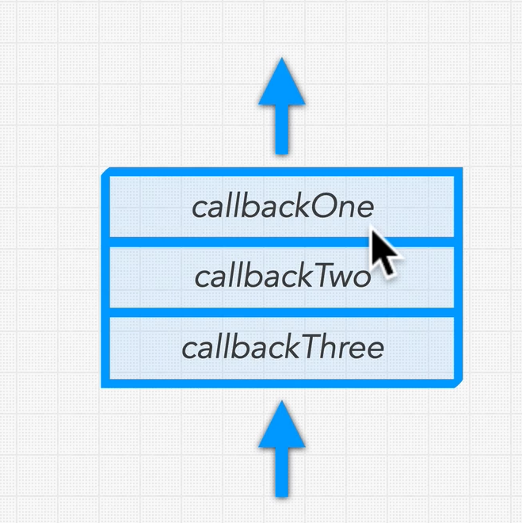

We know the Event Loop is code in libuv and handles async events/code, goes through any relevant callback functions in a loop. It exits when there are no more functions to perform.

## What happens when the event loop processes events?
- When node executes an async function, that operation is sent to be executed in the background (i.e. in our OS or on the threadpool)
- When that op finishes, and result is ready, node places any callback function it needs to run for that operation on a queue
- the callback queue keeps track of any callbacks ready to be executed
- callbacks are "added to the bottom and removed from the top" i.e. FIFO queue.

- This way all callbacks get a fair chance to be executed in a reasonable amount of time

# How does the eventloop use this callback queue? see [[software.frameworks.js.node.fundamentals-internals.phases-of-event-loops]]
