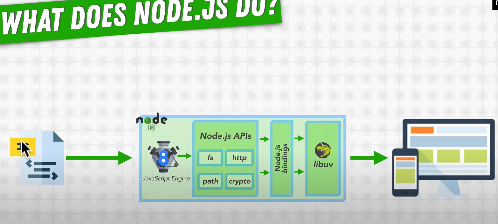

## What does Node.JS do?
- Some things other than vanilla JS out-of-the-box:
  - Node.js APIs (additional functions) like:
    - fs
    - http
    - path
    - crypto
  - Node.js Bindings
    - lets your JS code call functionality implemented in C/C++
  - libuv - bindings will pass request on to libuv, this acts like an operating system and the JS does not need to do anything while waiting -> Asynchronous Input/Output
    - Challenge: working with iOS, Windows, Linux
    - Libuv's strength is handling functionality and exposing to higher level layer, and transferring back to the Javascript

    ## The flow of the internals
    - Javascript code executed in v8 engine
    - Will make use of the Node.js APIs
    - When functions in APIs are called, they go through bindings
    - Then handled by libuv in some way

    
    eg. run through fs.open()

    ### Exploring the Open Source Code
    https://github.com/nodejs/node
      ### `lib` 
      - each file is representing functions in docs
      - eg `fs.js` has `function open(path, flags, mode, callback) {...}`
      - interestingly there is `binding.open(...)` function being called in the bindings
      - implementation is in `src` folder, explained below

      ### `src` 
      - C++ side 
      - from the example above `node_file.cc`
      - Has the C++ code
        - `Initialize` method - maps the js "open" with the C++ `static void Open`;
        - `uv_fs_open` is a function inside libuv which can be sync or async
        - Where is the functionality?! Internal workings of node
          - libuv source code

      ### `libuv` - internals Deep Dive
      https://libuv.org/
      https://github.com/libuv/libuv
      
      - in `src` find `unix` or `win` folder 
        - `fs.c` file
        - `uv_fs_open` called in a few places
        - implementation is at `uv__fs_open` (double underscore)
        - on windows `fs__open` (>100 lines of code!)
          - `_open_osfhandle`

Related : 
- [[software.frameworks.js.node.fundamentals-internals.sync-vs-async]]
- [[software.frameworks.js.node.fundamentals-internals.multithreading-processes-threads]]
- [[software.frameworks.js.node.fundamentals-internals.event-loop]]
- [[software.frameworks.js.node.fundamentals-internals.callback-queues]]
- [[software.frameworks.js.node.fundamentals-internals.phases-of-event-loops]]
- [[software.frameworks.js.node.fundamentals-internals.node-vs-php-python]]
- [[software.frameworks.js.node.fundamentals-internals.observer-design-pattern]]