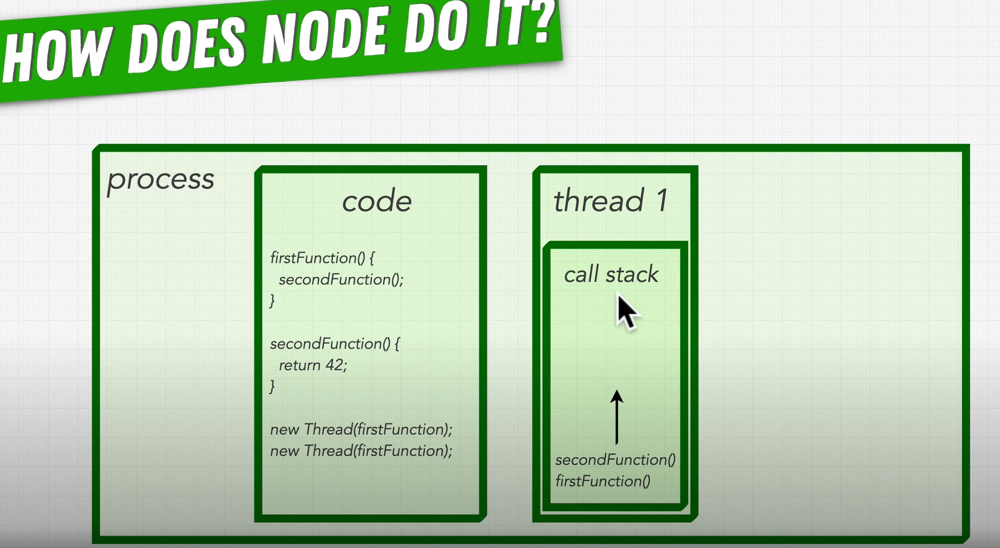
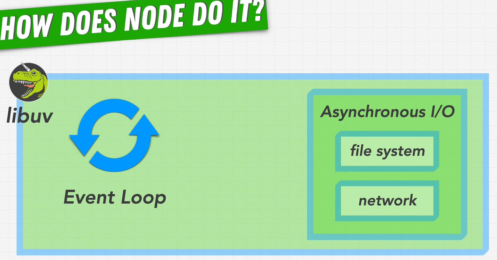
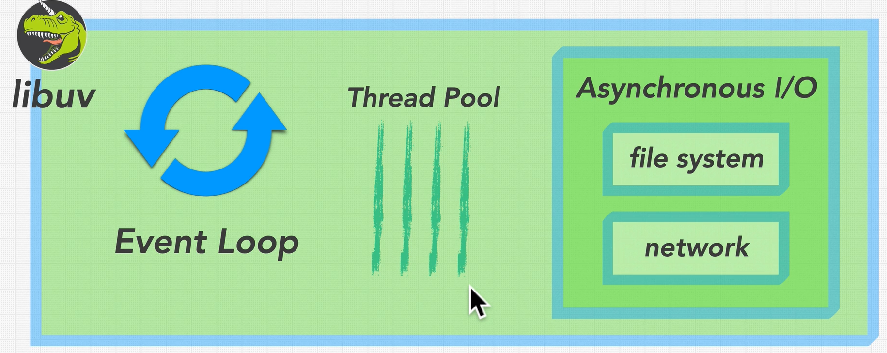
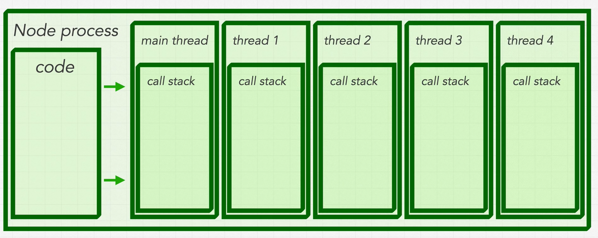

## What are threads? How do they help us?
- We've seen how function calls flow through the v8-engine/libuv process
- When you run a process on your machine, processes are containers of code that live in the memory of that process
- The idea is have multiple threads run in parallel, asynchronously
- `new Thread(firstFunction)` Passing in functions to be executed asynchronously, process creates new thread -> lives inside the memory for our process
- represents a single sequence of operations
- This sequence of operations lives in a `call stack`
  - functions added in sequence to call stack, completed functions are popped off from the top of the stack

- We have processes and threads inside them, they share memory and code but NOT call stacks
- Switch between multiple threads to simulate simultaneous operations/processes
- How does the process finish? Return values get sent
- Complex mechanisms to keep code synchronised between threads , done in C/C++/Java - hard to debug!
- Issues could arise (eg Deadlock, threads are stuck)
- Traditionally JS is a single-threaded language, it simplifies things by doing 1 thread at a time ... **so how does Node help with this?**

## Is Node.js Multi-threaded?
- Does node add threads to JS and hide them?
- Node executes JS code so it has to follow that single-threaded nature
- in Node, we have 1 main thread - this runs the v8 engine - our JS engine and Node APIs, and libuv `event loop`
- a blocking function in any of these components will cause JS to block, halting execution of our program until that blocking function completes!
- To answer this, need to look at the library `libuv` - it handles 2 main types of I/O:
  - file system
  - network
- We are able to execute all of this async because of the `event loop`
  - this is code in libuv that runs our asyn functions, executing the corresponding callback when the result of the function is ready. 
  - In Node when we call async functions, it gets placed in the event loop. This applies to the file system and network operations.
  - The event loop tells the OS to run the async function, deciding when the code executes and is complete.
  - It listens for events and delegates work
  - Where does the event loop work get completed? Some in the operating system, some in the `thread pool`.
  Inside of `libuv`, there is a group/collection of threads which are set up ahead of time and able to take on work when they arrive.
  - libuv in C-language which has threads, and thread pool takes advantage of that
  
  - One main thread that is executing v8 and the event loop
  - By default there are 4 threads waiting in the thread pool - limited set able to be re-used throughout the lifecycle of our node.js program
  - each of them able to handle 1 task at a time
  - This saves our CPU from creating/destroying new threads for every task that comes in
  
  
  - run out of threads? Need to wait for a task to complete before our thread pool is available again.
  - for `file system` operations, which use the thread pool, libuv will send the work to one of the threads, runs independently of all processes including the JS main thread (i.e. runs in the background)
  - when it completes, the event loop is notified of the result, executing the corresponding callback and ensuring the app is running smoothly
  - only SOME operations use this thread pool
  - NOT all async functions are executed in the thread pool - Node.js actively avoids this because threads are more complex and use up the limited resources of our threadpool
  - instead libuv tries to use the OS directly, like the Op System kernel - which talks to the computer's hardware. This is what the kernel is good at, like talking to other computers over the network.
  - IF the funcitonality exists in your OS, libuv will make that call to save resources/skip over the threadpull
  - The event loop will receive signals and execute any callbacks
  