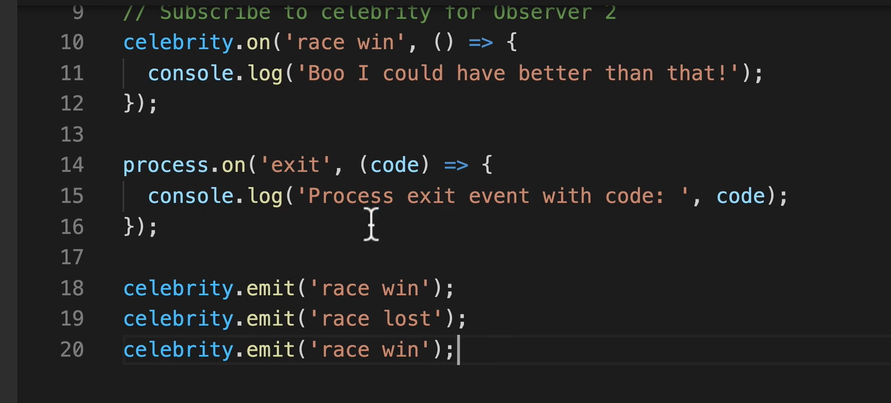

Design patterns are proven approaches that solve problems appearing repeatedly in all kinds of different programs and apps.

We can avoid reinventing the wheel from scratch everytime we encounter a new problem.

### Analogy
- Celebrity, subject of being observed
- fans are interested in observing - subscribe to events relevant to the subject occuring
- This event comes from the subject, who notifies all the observers as long as the observer is subscribed
- Each observer can react in their own way to the events
- Whatever the observer/subject are doing, we use this pattern when the subject being observed doesn't just trigger one event, but instead creates a series of events which can be listened by multiple observers and occur simultaneously -> Many to one relationship between observers and subjects
- A button might be represented this way as well eg button hover/click events
- a Database can be represented this way too, on different collections of data
- each of those respond to different events
- Basis for popular frontend frameworks like React.

### How we use this pattern? The NODE EVENT EMITTER
- The observer design pattern can model problems
- In node, notifications of events are through `callback` functions.
- Node module that is useful: `events` module
https://nodejs.org/api/events.html#events_events
- Node.js API is built around async event architecture
- emitters emit named events, and listeners are called (they are callback functions)
- events are emitted (sent out or triggered events) through an `EventEmitter` class

```js
const EventEmitter = require('events');
const celebrity = new EventEmitter();

// different observers could be subscribing to different events of the celebrity
// Subscribe to celebrity for Observer 1
celebrity.on('race', (result) => {
  if (result == 'win') {
    console.log('Congratulations! You are the best!')
  }
});

// Subscribe to celebrity for Observer 2
celebrity.on('race', (result) => {
  if (result == 'win') {
    console.log('Boo I could have done better than that!')
  }
});

process.on('exit', (code) => {
  console.log('Process exit event with code: ', code);
});

celebrity.emit('race', 'win')
celebrity.emit('race', 'lost')

```

## Process
- Process is an event emitter. Once program exits, then exit handler is triggered with an exit event when program is ready to exit:
`process.on('exit', ...)`

