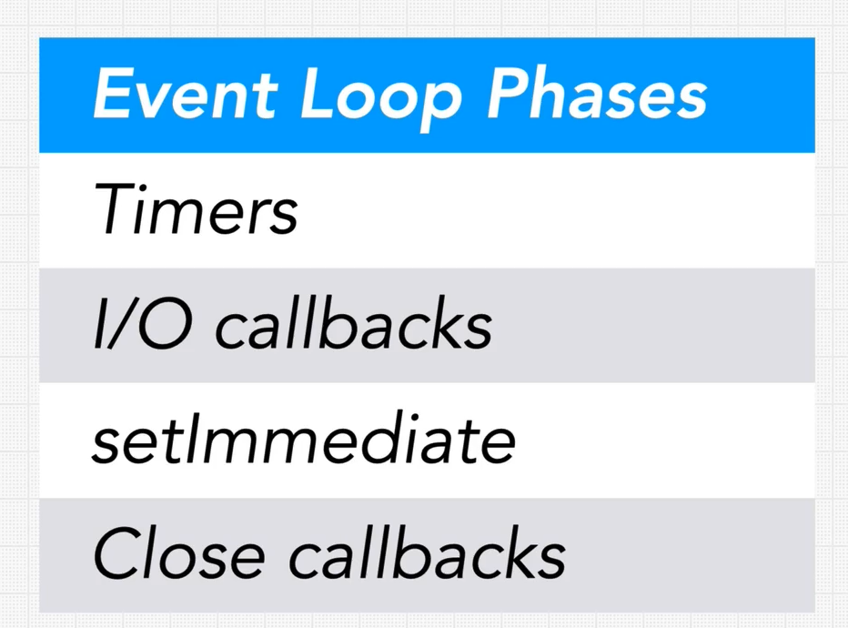

We know callbacks are placed in a queue to be executed at a later time.

## What does the Event loop do with our callback queue?
- There is no one callback queue!
- In the event loop, there are several different queues - each one handles a different phase of the event loop
- Each phase of the event loop is responsible for different types of operations
- 4 main phases of the event loop, each of these stages is responsible for a different category of operations that the event loop processes

- Each phase has its own callback queue!
  - Timers - eg setTimeout callback would go in this queue. 3 types of timers in Node:
    - setTimeout
    - setInterval (function loops over)
    - setImmediate (executed as soon as possible, in theory immediately, but reality differs)
  - I/O Callbacks - eg `fs` operations go into the I/O queue, responsible for all I/O Async ops (aka POLL QUEUE)
- How the event loop flows through its different phases:
  - it checks the Timer queue to see any functions are to be executed, when done
  - next phase (still in first iteration/tick of the event) is the I/O callback queue, `fs` or `network` operations
  - setImmediate phase executes after, so NOT so immediate... it actually only runs immediate after any I/O ops, and before any next cycle/tick of the event loop
  - close callback phase, after this is done, the `event loop` cycle begins again
  - there are other internal node phases in the event loop: idle & prepare phases, but our JS cannot do anything with these.
  - The four mentioned phases illustrate the event loop and how JS is affected
