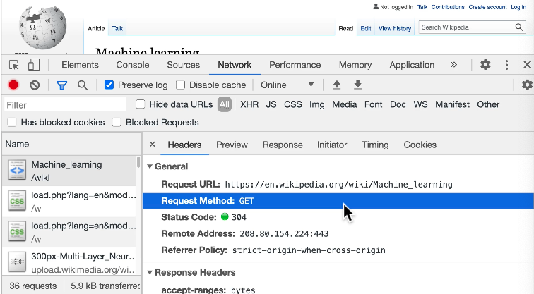
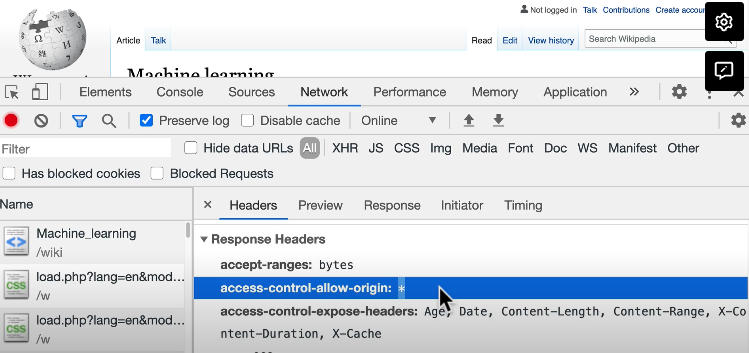

## Cross Origin Resource Sharing
- a way to relax same-origin policy
- potentially can make apps that span different domains
- How does wikipedia do it?
  - see `Network` tab in dev tools
  - Can identify in Headers that

### Response headers: ` access-control-allow-origin: *` 
- a Header set on server, specifies origins that files can be shared with - otherwise by default you can only have your own domain talk to your own server - often not practical when dealing with outside APIs
- Could specify a URL as part of list of allowed origins from places you expect/allow. 
eg ` access-control-allow-origin: https://www.google.com`
- To allow all (allow requests from any origin) with : `access-control-allow-origin: *`
- Avoid allowing potentially malicious sites from interacting with your site
- Whitelisting is the practice of allowing access to a particular service -> opposite of blacklisting