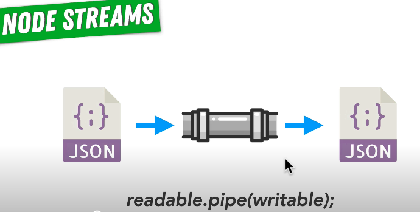

## How to make an endpoint that echoes back users request
- Answer lies in how request and response are readable/writeable streams
- Data will flow to client via response:
`req.pipe(res)`;
- In the Kepler project (ref: /Users/sayf/Documents/ZTM_Node/index.js) we had the CSV file being read as a stream and being piped into the CSV- parser to get the parsed rows of the CSV file -> we can do something similar
- `readable.pipe(writable);`
