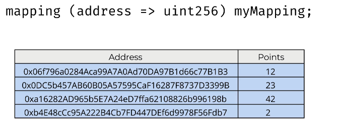
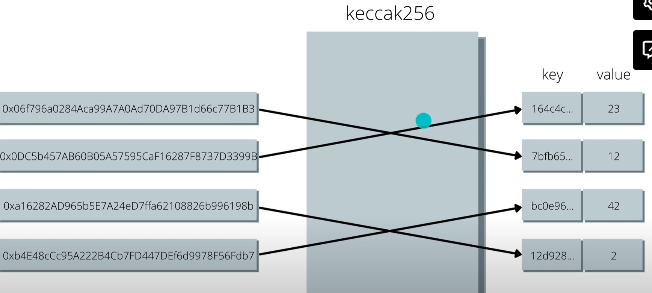
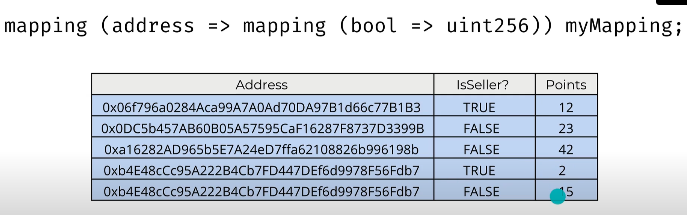

Default value: an empty mapping

- They are like tables! 
- And like hash tables which map keys to values
- allows for efficient **storing and reading of data**!
- no length
no keys



Throwing in some keccak256 (the hash function part of EVM)...

- first calculate the hash
- then read the value

```solidity
// mapping that maps to another mapping
// just means MULTIPLE COLUMNS

mapping(address => mapping (bool => uint256)) myMapping;

```



If mapping is `public`, Solidity will automatically create public view function of same name.

`function myMApping(address param) public view returns(uint256);`

Mappings can only be storage - they cannot be parameters of return values of public functions, but can be passed as parameters for internal functions if needed.