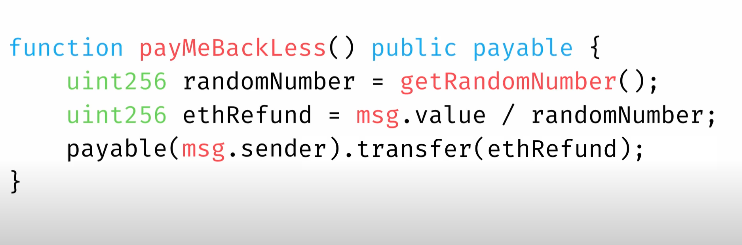
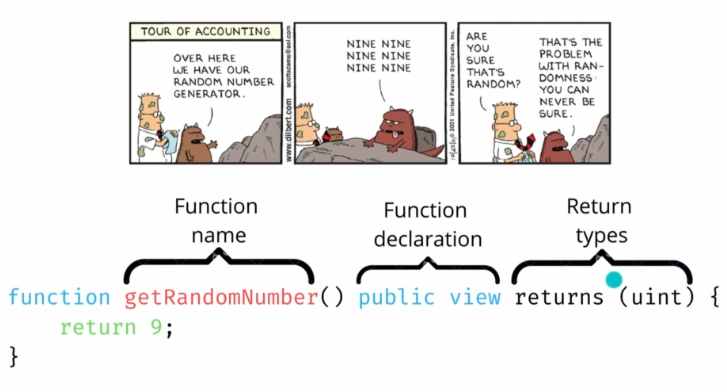
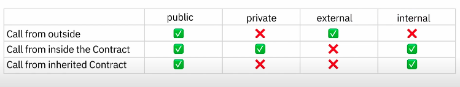

# Fundamentals

## What is solidity?
- It is strongly typed:
  - Every variable has a predetermined exact type

## How do we use solidity?
- Under the hood
  - compiler called `solc`
  - transforms the solidity code into `opcodes`, `ABI` and `metadata`
  - `ABI` is like having an interpreter translating between you and smart contract
  - `metadata` allows us to verify data without using etherscan, and gives info on things like 
    - compiler version
    - source code
    - ABI
    - additional documentation

## Normal vs View Functions
- normal function 
  - someone has to sign a transaction with private key
  - change state

  - payable declared means anyone can optionally send ether funds along with the transaction
- view function does not require private key

- pure means special type of view function, the function doesn't require any data
  - not reading data from the contract

## Public vs Private Functions

- public 
  - anyone inside / outside interacting with ethereum network can call
  - if public / external, functions are shown in ABI, so reading data is easy by calling function
- private
  - convention in naming functions is to prefix names with `_`
  - Not part of the ABI, but it only makes it harder for someone outside to read the data. Other contracts however cannot read private stuff since they need info from ABIs.

[Solidity Docs v0.8.15](https://docs.soliditylang.org/en/v0.8.15/index.html)

[[software.languages.solidity.primitive-data-types]]

[[software.languages.solidity.variables]]

[[software.languages.solidity.constants]]

[[software.languages.solidity.immutable]]