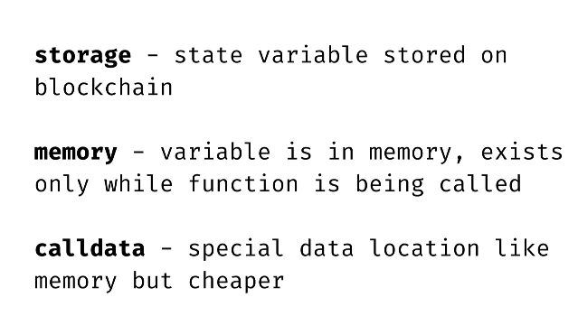

There are 3 keywords for the data location for variables...

... Needed for reference types like **strings, structs, arrays and mappings**
- whatever is declared as the data location, it will have an impact in the way data is copied
- eg a calldata item is saved to a state variable