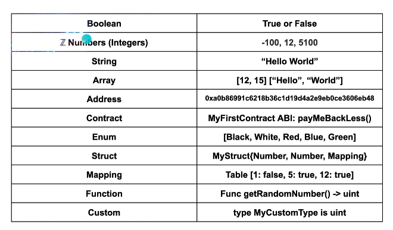
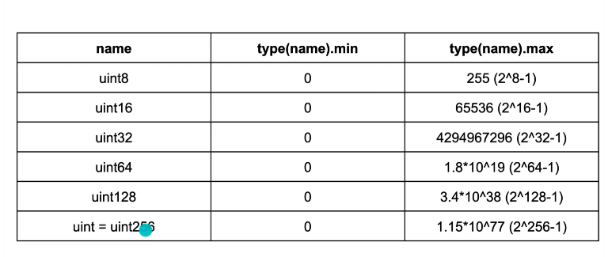
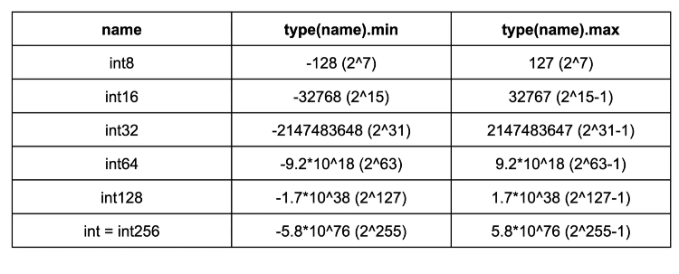

- boolean
- uint
- int
- address

## uint



EVM uses 32 bytes i.e. 256 bits , so best to use uint256

Why are there the smaller types like uint8? can pack the variables together for storage optimisation

uint stands for unsigned integer, meaning non negative integers
different sizes are available  
  `uint8   ranges from 0 to 2 ** 8 - 1`  
  `uint16  ranges from 0 to 2 ** 16 - 1`  
  ...
  `uint256 ranges from 0 to 2 ** 256 - 1`  
  `uint is an alias for uint256`

## int

Negative numbers are allowed for int types.
Like uint, different ranges are available from int8 to int256  
  `int256 ranges from -2 ** 255 to 2 ** 255 - 1`  
  `int128 ranges from -2 ** 127 to 2 ** 127 - 1`
  `int is same as int256`

## address
eg
`address public addr = 0xCA35b7d915458EF540aDe6068dFe2F44E8fa733c;`

# Default values
## Unassigned variables have a default value
```solidity
bool public defaultBoo; // false
uint public defaultUint; // 0
int public defaultInt; // 0
address public defaultAddr; // 0x0000000000000000000000000000000000000000
```

# Bytes
- In Solidity, the data type byte represent a sequence of bytes. 

- Solidity presents two type of bytes types :
  - fixed-sized byte arrays
  - dynamically-sized byte arrays.
  
- The term bytes in Solidity represents a dynamic array of bytes. It’s a shorthand for byte[] .

```solidity
bytes1 a = 0xb5; //  [10110101]
bytes1 b = 0x56; //  [01010110]
```