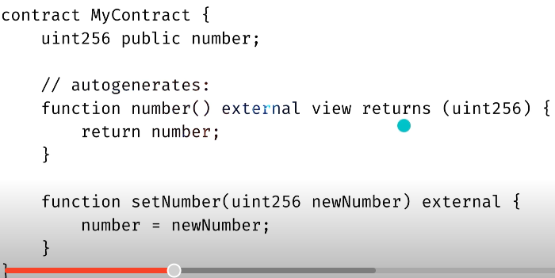

## This is where the magic happens!
- When a state variable is private, you can only read or write it with a function in the current contract

- Solidity automatically generates getters and setters for public variables:
