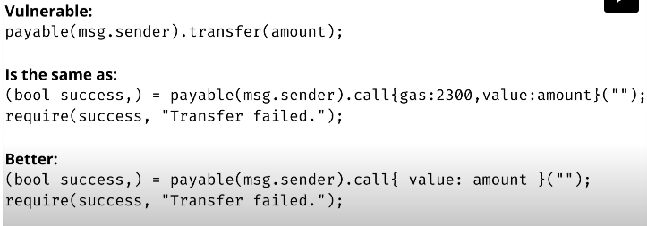

- The address type is 20 bytes long
- When storing in the EVM there are 32-byte slots - actually wasting 12 bytes!
- but to optimise this, the address type has some extra features:
```solidity

// say you have two addresses, one normal and one is payable (i.e. able to receive either)
address myAddress1;
address payable myAddress2;

// you can convert between the two types by using the address or payable keywords
Convert into address from payable: address(myAddress2)
Convert into payable from address: payable(myAddress1)

// you can call the following functions
myAddress.balance // read current ether balance
myAddress.transfer
myAddress.call

```

## How to use call()
```solidity

// in this case we are sending ether, not calling any functions in the parenthesis
(bool success,) = payable(msg.sender).call{value:amount}(""); 
require(success, "Transfer failed.");

```
- data part empty
- You could add data here to call functions in the smart contract which would need to be ABI encoded
- but usually not needed since solidity has a Contract type like the Address type but allows you to do these kind of calls by writing function calls in solidity


## Why not use the transfer() function???


- The transfer function is the same as the call function but set the gas to 2300, which is a precaution
- There is no guarantee EVM opcodes gas costs will not change in the future - better to leave gas field empty!
- how much gas sent when we don't define the field? you would be passing along all the gas that the current transaction has.
- but there needs to be enough gas after the call to finish the current function call
- Need to avoid re-entrancy where an infinite loop is created
- Can use special re-entrancy guards