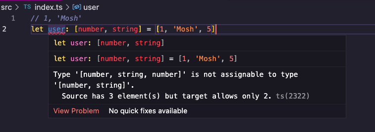

- New type which is a fixed length array, where each element is a particular type



One instance where the compiler does not catch anything wrong
```ts
// 1, 'Mosh'
let user: [number, string] = [1, 'Mosh'];
user.push(5);

```