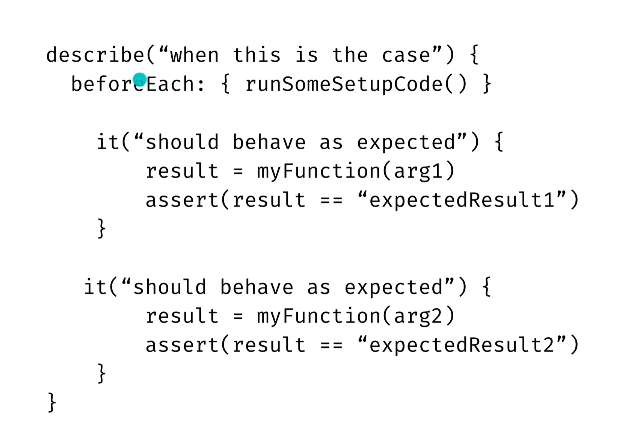
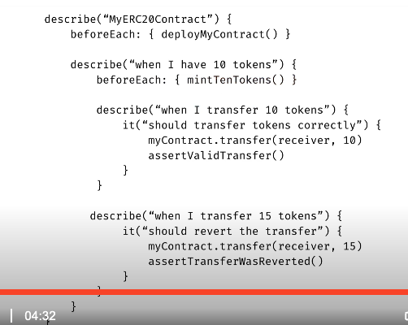

## Development setup

The below code can be used to run the project setup, and should be used in case the commands you ran from the course caused any issues.

```html
mkdir my-project
cd my-project
npm init --yes
npm install --save-dev hardhat@^2.8.3
npm install --save-dev "@nomiclabs/hardhat-waffle@^2.0.0" "ethereum-waffle@^3.0.0" "chai@^4.2.0" "@nomiclabs/hardhat-ethers@^2.0.0" "ethers@^5.0.0" 
"@nomiclabs/hardhat-etherscan@^2.1.3" "dotenv@^10.0.0" "eslint@^7.29.0" "eslint-config-prettier@^8.3.0" "eslint-config-standard@^16.0.3"
"eslint-plugin-import@^2.23.4" "eslint-plugin-node@^11.1.0" "eslint-plugin-prettier@^3.4.0" "eslint-plugin-promise@^5.1.0" "hardhat-gas-reporter@^1.0.4"
"prettier@^2.3.2" "prettier-plugin-solidity@^1.0.0-beta.13" "solhint@^3.3.6" "solidity-coverage@^0.7.16" "@typechain/ethers-v5@^7.0.1"
"@typechain/hardhat@^2.3.0" "@typescript-eslint/eslint-plugin@^4.29.1" "@typescript-eslint/parser@^4.29.1" "@types/chai@^4.2.21" "@types/node@^12.0.0"
"@types/mocha@^9.0.0" "ts-node@^10.1.0" "typechain@^5.1.2" "typescript@^4.5.2"
npx hardhat
> Choose: Create an advanced sample project that uses TypeScript
```

## Enabling transfers
- allow anyone to do so
- we first need a way to store balances
- need to be able to transfer tokens on behalf of someone else

```solidity

// SPDX-License-Identifier: MIT
pragma solidity 0.8.11;

contract ERC20 {
  uint256 public totalSupply;
  string public name;
  string public symbol;
  
  // mapping(address => uint256) private balances;
  mapping(address => uint256) private balanceOf;
  // we need this mapping to store which owner address have approved how much funds for which spender
  mapping(address => mapping(address => uint256)) public allowance;


  // function allowance(address owner, address spender) public view returns (uint256) {
  //   allowances[owner][spender];
  // }
  // solidity already automatically generates this!

  // function balanceOf(address owner) public view returns (uint256) {
  //   return balances[owner];
  // }
  // solidity already automatically generates this!

  constructor(string memory _name, string memory _symbol) {
    name = _name;
    symbol = _symbol;
  }

  function decimals() external pure returns (uint8) {
    return 18;
  }

  function transfer(address recipient, uint256 amount) external returns (bool) {
    require(recipient != address(0), "ERC20: transfer to the zero address");

    uint256 senderBalance = balanceOf[msg.sender];

    require(senderBalance >= amount, "ERC20: transfer amount exceeds balance");

    balanceOf[msg.sender] = senderBalance - amount;
    balanceOf[recipient] = balanceOf[recipient] + amount; // can use `+=`

    return true;
  }

  
}

```

## Enabling transferFroms

```solidity

// SPDX-License-Identifier: MIT
pragma solidity 0.8.11;

contract ERC20 {
  uint256 public totalSupply;
  string public name;
  string public symbol;
  
  // mapping(address => uint256) private balances;
  mapping(address => uint256) private balanceOf;
  // we need this mapping to store which owner address have approved how much funds for which spender
  mapping(address => mapping(address => uint256)) public allowance;

  constructor(string memory _name, string memory _symbol) {
    name = _name;
    symbol = _symbol;
  }

  function decimals() external pure returns (uint8) {
    return 18;
  }

  function transfer(address recipient, uint256 amount) external returns (bool) {
    return _transfer(msg.sender, recipient, amount);
  }

  function transferFrom(address sender, address recipient, uint256 amount) external returns (bool) {
    uint256 currentAllowance = allowance[sender][msg.sender];

    require(
      currentAllowance >= amount,
      "ERC20: transfer amount exceeds allowance"
    );

    allowance[sender][msg.sender] = currentAllowance - amount;

    return _transfer(msg.sender, recipient, amount);
  }

// approve the token to some other address (spender)
// this spender can transfer approved tokens
  function approve(address spender, uint256 amount) external returns (bool) {
    require(spender != address(0), "ERC20: approve to the zero address");

    allowance[msg.sender][spender] = amount;

    return true;
  }

  function _transfer(address sender, address recipient, uint256 amount) private returns (bool) {
    require(recipient != address(0), "ERC20: transfer to the zero address");

    uint256 senderBalance = balanceOf[sender];

    require(senderBalance >= amount, "ERC20: transfer amount exceeds balance");

    balanceOf[sender] = senderBalance - amount;
    balanceOf[recipient] = balanceOf[recipient] + amount; // can use `+=`

    return true;
  }
}

```

## How can we test contracts?
- problem: takes a lot of time
- we need to test efficiently all edge cases - Automated testing!
- testing our contracts via writing code
- Write code that automatically deploys contract, calls functions and verifies results are as expected
- Testing via small units aka unit testing
- All-in-one aka integration testing
Mocha test structure:
- `describe`: context - used to organise tests via different scenarios
- `beforeEach`: setup
- `it`: assertion - can have multiple of these






## What remains: events