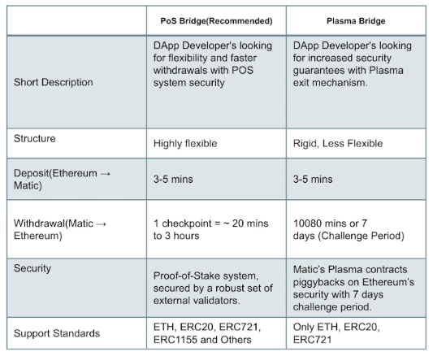
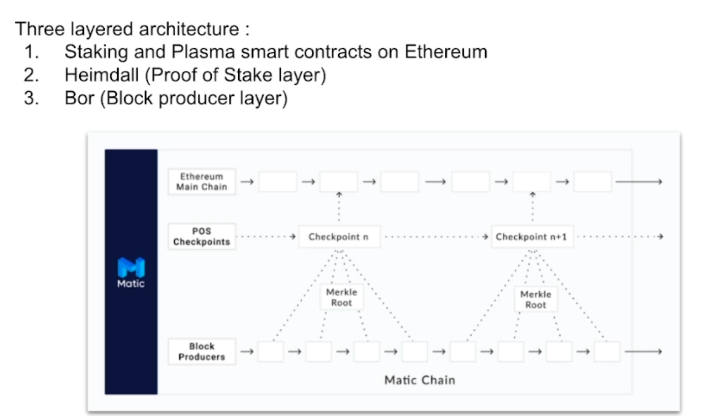
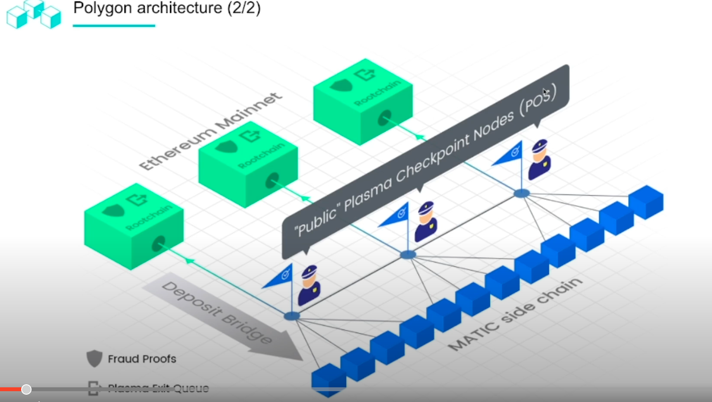
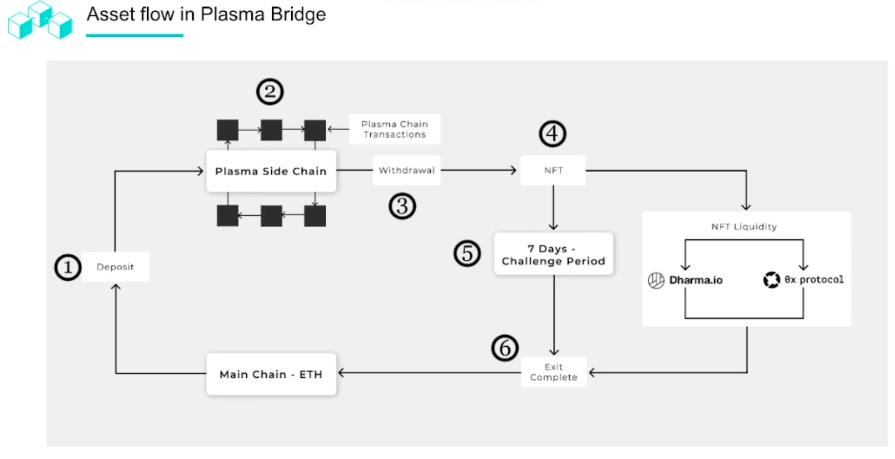
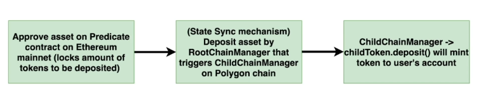

- Polygon brings trustless 2-way transaction channel between Ethereum <-> Polygon via introducing a cross-chain bridge with Plasma and PoS security
- Using this bridge, users can transfer without incurring 3rd party risk and market liquidations
- Testnet: Mumbai
- Mainnet: Mainnet
- Polygon bridge provides a scaling solution, highly flexible
- Dual consensus infrastructure that optimises speed and decentralisation -> Dual Consensus Architecture
- Architecture of Polygon system is developed to support arbitrary state transitions on side-chains
- The Polygon chain is EVM compatible
- Token supply in Ethereum network is locked and Polygon too. 1:1
  - burning mechanism to dive into
- PoS
  - security provided by external validators

- Blockchain application platform that provides hybrid PoS and Plasma enabled side-chains, full-blown EVM side-chains,
- Coming soon: optimistic rollups
- Devs can use Plasma for state transitions
- For arb state transition, can use PoS
- Incentivised validators on Heimdall PoS layer
- Bor (block producer layer) is also known as a side-chain
- Ethereum is the forced base chain

## The 3 layers

### Ethereum Mainnet
- Where the polygon set of smart contracts are deployed and being maintained
- Smart contracts handle the staking management for the PoS layer

### PoS Layer
- delegation management which includes the validator's shares and the plasma contracts
- Every X amount of time, state sync mechanism that does a snapshotting to the Eth mainnet via a PoS layer
- Run by a group of validators
- aka Heimdall
- PoS validation mechanism on polygon
- Heimdall layer is handling the aggregation of the blocks produced by the Bor into a Merckle-tree root that is published periodically to the root chain (Ethereum mainnet)
- Checkpoint nodes provide finality to the root chain, Proof-of-burn, root of the blocks
- The process is like a sub-set of active validators
- Block producers validation delegated from this layer
  - validated periodically by the Heimdall nodes

### MATIC side chain

## Asset Flow in Plasma Bridge

- What is the flow?
  - Starts with a deposit step
  - Deposit of crypto assets into Polygon contract by user
  - Once deposited and confirmed on the main chain, the corresponding tokens reflected on the Polygon chain
  - Transfers are fast
  - When user is ready, can withdraw tokens from main chain - initiated by the Plasma side-chain
  - all blocks need validation from checkpoint and submitted to main Eth chain
  - User has 7 day challenge period from main chain contract

## PoS Bridge (Deposit)

- Owner of asset eg ERC20 or ERC721

